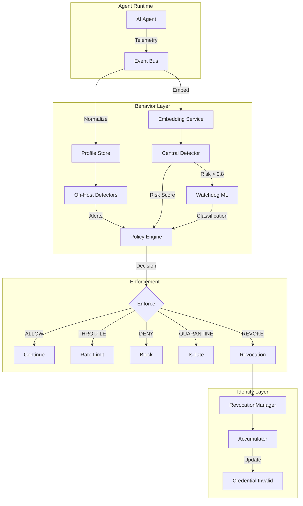
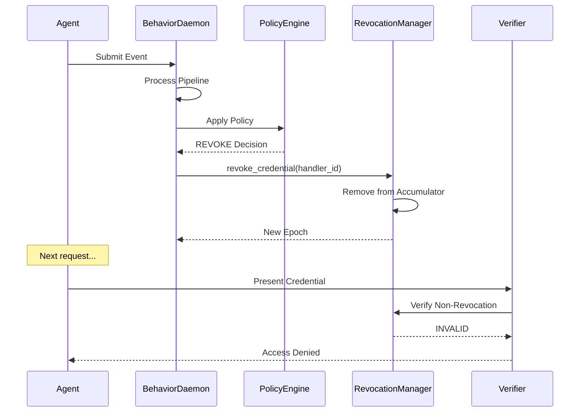

The Behavior Layer provides continuous runtime monitoring of AI agent activities, detecting anomalous behavior patterns and automatically triggering credential revocation when agents misbehave.

## Overview

<CardGroup cols={3}>
  <Card title="Identity Layer" icon="id-card">
    Who the agent is (DIDs, VCs)
  </Card>
  <Card title="Integrity Layer" icon="shield">
    What the agent can do (ABAC)
  </Card>
  <Card title="Behavior Layer" icon="eye">
    How the agent behaves (monitoring)
  </Card>
</CardGroup>

The Behavior Layer completes the security triad by monitoring **runtime behavior** after identity verification and access control decisions.

---

## Architecture Diagram



---

## Component Responsibilities

### Event Bus

The Event Bus normalizes raw telemetry into analysis-ready events:

| Function | Description |
|----------|-------------|
| **Normalize** | Add schema version, validate fields |
| **Enrich** | Add tool risk, tokens/second, repeat flags |
| **Embed** | Generate semantic embeddings |
| **Fan-out** | Distribute to processing paths |

```python
# Event normalization
event = event_bus.normalize({
    "event_id": "...",
    "agent_id": "researcher-1",
    "tool_name": "SearchTool",
    "payload": "Find research papers",
    ...
})

# Enriched event includes:
# - tool_risk: "low"
# - tokens_per_second: 42.5
# - is_repeat_prompt: False
# - embedding: [0.1, 0.2, ...]
```

### Profile Store

Maintains per-agent behavioral baselines using Exponential Moving Averages (EWMA):

| Baseline | Description |
|----------|-------------|
| `token_ewma` | Average token count |
| `calls_ewma` | Average calls per minute |
| `embedding_centroid` | Semantic baseline vector |
| `tool_usage` | Tool usage frequency |
| `recent_events` | Sliding window of events |

### On-Host Detectors

Fast, deterministic detectors for real-time alerting:

```
TOKEN_SPIKE          → Token count significantly above baseline
SENSITIVE_CONTENT    → Sensitive keywords detected
BURST_ACTIVITY       → High-rate token generation
REPEAT_QUERY         → Repeated identical prompts
UNAUTHORIZED_TOOL    → Tool access without permission
NEW_SENSITIVE_TOOL   → First use of high-risk tool
TOOL_SWITCH_ANOMALY  → Rapid tool switching
LONG_SESSION         → Extended active session
```

### Central Detector

ML-powered detector for complex attack patterns:

- **Semantic Drift**: Cosine distance from embedding centroid
- **Window Drift**: Deviation from recent behavior
- **Attack Classification**: Pattern-based categorization
- **Risk Accumulation**: Temporal persistence (80% previous + new)
- **Decay**: Risk reduction for benign behavior

### Watchdog

Semantic classifier using few-shot learning:

| Label | Attack Pattern |
|-------|---------------|
| `PII_EXTRACTION` | Access personal/financial data |
| `PROMPT_INJECTION` | Override system behavior |
| `DATA_EXTRACTION` | Dump/export internal data |
| `MODEL_EXTRACTION` | Reveal system internals |

### Policy Engine

Deterministic enforcement decisions:

| Threshold | Action | Description |
|-----------|--------|-------------|
| 0.60 | THROTTLE | Rate limit |
| 0.75 | QUARANTINE | Isolate temporarily |
| 0.90 | HONEYPOT | Route to deception |
| 0.95 | REVOKE | Credential revocation |

---

## Revocation Integration

The Behavior Layer directly integrates with the Identity Layer's RevocationManager:



### Revocation Triggers

| Condition | Action |
|-----------|--------|
| Risk ≥ 0.95 + Malicious Label | Immediate revocation |
| Unauthorized Tool + Prompt Injection | Immediate revocation |
| Risk ≥ 0.75 + Corroborating Signals | Quarantine + Warning |

---

## Data Flow

### Event Lifecycle

```
1. TELEMETRY
   Agent activity → make_event() → Raw event

2. NORMALIZATION
   Raw event → EventBus.normalize() → Enriched event

3. PROFILING
   Enriched event → ProfileStore.update() → Updated baseline

4. DETECTION
   Event → OnHostDetectors.detect() → Alerts
   Event → CentralDetector.score() → Risk score
   [High risk] → Watchdog.classify() → Attack label

5. POLICY
   (Alerts, Risk, Label) → PolicyEngine.decide() → Decision

6. ENFORCEMENT
   Decision → Execute actions
   [REVOKE] → RevocationManager → Credential invalid
```

---

## Security Properties

### Detection Guarantees

| Property | Implementation |
|----------|---------------|
| Real-time | On-host detectors < 1ms latency |
| Semantic | ML embeddings for paraphrase detection |
| Temporal | Risk accumulation across events |
| Deterministic | Same inputs → same policy decision |

### Revocation Properties

| Property | Guarantee |
|----------|----------|
| Instant | Revocation takes effect immediately |
| Irreversible | Cannot un-revoke credentials |
| Cryptographic | Accumulator-backed verification |
| Auditable | Full audit trail of decisions |

---

## Deployment Modes

### Async Mode (Production)

```python
daemon = BehaviorDaemon(
    revocation_manager=revocation,
    enable_async=True,  # Background thread
)
daemon.start()

# Events processed in background
daemon.submit_event(event)
```

### Sync Mode (Testing)

```python
daemon = BehaviorDaemon(
    enable_async=False,  # Synchronous processing
)

# Events processed immediately
result = daemon.submit_event(event)
```

---

## Configuration Options

| Parameter | Default | Description |
|-----------|---------|-------------|
| `watchdog_threshold` | 0.8 | Risk score for ML classification |
| `process_interval` | 0.1s | Background processing interval |
| `throttle_threshold` | 0.60 | Risk score for rate limiting |
| `quarantine_threshold` | 0.75 | Risk score for isolation |
| `honeypot_threshold` | 0.90 | Risk score for deception |
| `revocation_threshold` | 0.95 | Risk score for revocation |

---

## Integration with Other Layers

### Identity Layer

- Receives agent DIDs and credential handler IDs
- Calls `RevocationManager.revoke_credential()` on critical threats
- Logs revocation to audit trail

### Integrity Layer

- Enforces ABAC policies independently
- Behavior Layer provides additional runtime checks
- Can inform policy decisions with risk scores

---

## Metrics and Observability

```python
# Daemon statistics
stats = daemon.stats()
# {
#     "running": True,
#     "total_events_processed": 1523,
#     "alerts_triggered": 45,
#     "revocations_triggered": 2,
#     "pending_events": 3,
#     "profiled_agents": 12,
#     ...
# }

# Audit log for high-risk events
audit_log = daemon.get_audit_log(limit=100)

# Revocation history
revocations = daemon.get_revocation_records()
```

---

## Next Steps

<CardGroup cols={2}>
  <Card title="Behavior Documentation" icon="book" href="/flows/behavior">
    Detailed usage guide
  </Card>
  <Card title="Revocation Flow" icon="ban" href="/flows/revocation">
    Credential revocation details
  </Card>
  <Card title="Identity Layer" icon="id-card" href="/architecture/identity-layer">
    DID and credential management
  </Card>
  <Card title="Security Model" icon="shield" href="/architecture/security-model">
    Overall security guarantees
  </Card>
</CardGroup>
