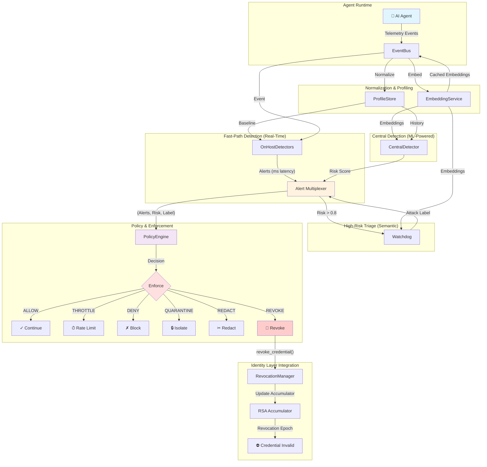
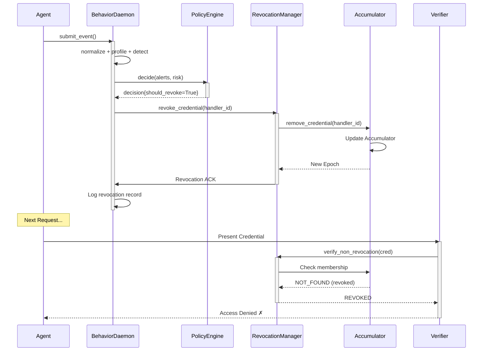
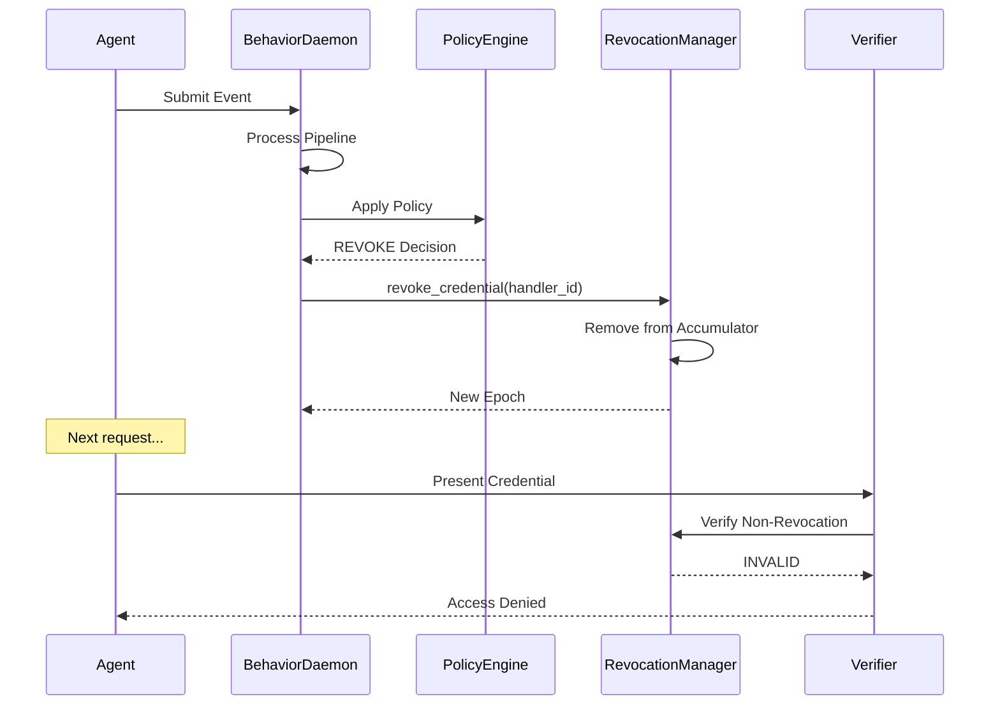

The Behavior Layer provides continuous runtime monitoring of AI agent activities, detecting anomalous behavior patterns through multi-stage detection pipelines and automatically triggering credential revocation when critical threats are identified.

## Overview

The Behavior Layer completes the Arbiter security triad:

<CardGroup cols={3}>
  <Card title="Identity Layer" icon="id-card">
    Who the agent is (DIDs, VCs)
  </Card>
  <Card title="Integrity Layer" icon="shield">
    What the agent can do (ABAC)
  </Card>
  <Card title="Behavior Layer" icon="eye">
    How the agent behaves (monitoring)
  </Card>
</CardGroup>

While the Identity and Integrity layers verify agent identity and enforce static access control policies, the Behavior Layer monitors **runtime behavior** and **detects threats after access is granted**, triggering immediate credential revocation for critical threats.

---

## Architecture Diagram



---

## Component Responsibilities

### Event Bus

The Event Bus normalizes raw telemetry into analysis-ready events and enriches them with derived features for detection.

**Responsibilities:**
- **Schema Validation**: Ensure required fields present, validate types
- **Enrichment**: Add tool risk classification, tokens per second, repeat detection
- **Embedding**: Generate semantic embeddings for similarity analysis
- **Caching**: Cache embeddings to minimize model inference

**Output Example:**
```python
normalized_event = {
    # Original fields
    "event_id": "evt-123",
    "agent_id": "researcher-1",
    "tool_name": "SearchTool",
    "payload": "Find papers on security",
    "token_count": 42,
    "timestamp": 1706313600.0,
    
    # Enriched fields
    "schema_version": "1.1",
    "tool_risk": "low",
    "tokens_per_second": 42.0,
    "is_repeat_prompt": False,
    "near_duplicate_hash": "a1b2c3d4e5f6g7h8",
    "embedding": np.array([0.1, 0.2, ..., 0.384])  # 384-dimensional
}
```

**Thresholds:**
| Parameter | Value | Purpose |
|-----------|-------|---------|
| `EVENT_SCHEMA_VERSION` | "1.1" | Compatibility tracking |
| Cache TTL | Unlimited | Embeddings cached until process reset |

---

### Profile Store

Maintains adaptive per-agent behavioral baselines using Exponential Moving Averages (EWMA).

**Key Metrics (Per Agent):**
| Metric | Update | Usage |
|--------|--------|-------|
| `token_ewma` | α×new_count + (1-α)×old_ewma | Detect token count spikes |
| `calls_ewma` | α×calls/min + (1-α)×old_ewma | Detect activity rate changes |
| `embedding_centroid` | α×new_embedding + (1-α)×old_centroid | Semantic drift detection |
| `tool_usage` | Frequency count | Detect unauthorized tool access |
| `recent_events` | Sliding deque | Temporal pattern analysis |

**EWMA Smoothing:**
- Default α = 0.2 (responds to changes over ~5 events)
- Higher α = more responsive; Lower α = more stable
- Allows gradual behavior adaptation while detecting anomalies

**Profile Lifecycle:**
```
Agent First Event → Initialize Profile
│                    ├─ token_ewma = token_count
│                    └─ embedding_centroid = embedding
│
Subsequent Events → Update EWMA Values
│                    ├─ Compute token_ewma
│                    ├─ Update embedding_centroid
│                    ├─ Track tool usage
│                    └─ Maintain recent_events deque
```

---

### On-Host Detectors

Fast, deterministic, rule-based anomaly detectors requiring **no ML** inference.

**Design Goals:**
- **Low Latency**: < 1ms per detection
- **Deterministic**: Same inputs → same outputs
- **No Dependencies**: No ML libraries required
- **High Specificity**: Minimize false positives

**Detection Types:**

| Alert | Mechanism | Confidence | Use Case |
|-------|-----------|-----------|----------|
| `TOKEN_SPIKE` | tokens > mean + 2×stddev | High | Abnormal request size |
| `SENSITIVE_CONTENT` | Keyword regex match | Medium | PII/password keywords |
| `PROMPT_INJECTION` | Instruction override patterns | High | Jailbreak/instruction override |
| `CREDENTIAL_THEFT` | Auth material keywords | High | Credential theft attempts |
| `DATA_EXFILTRATION` | Exfil keyword patterns | High | Data exfiltration attempts |
| `SENSITIVE_OPERATION` | High-risk operation patterns | Medium | Unauthorized sensitive ops |
| `BEHAVIORAL_ANOMALY` | Repeated/repeated patterns | Medium | Reconnaissance patterns |
| `BURST_ACTIVITY` | tokens/sec > 100 | Medium | Rapid-fire requests |
| `REPEAT_QUERY` | Hash match in recent | High | Identical repeated prompts |
| `UNAUTHORIZED_TOOL` | Tool not in auth list | High | Policy violation |
| `NEW_SENSITIVE_TOOL` | High-risk tool + first use | Medium | Privilege escalation |
| `TOOL_SWITCH_ANOMALY` | > 2 tools in window | Medium | Rapid tool switching |
| `LONG_SESSION` | > 10 events with activity | Medium | Extended engagement |

**Thresholds:**
```python
BURST_TOKENS_PER_SECOND_THRESHOLD = 100  # tokens/sec
SESSION_LENGTH_THRESHOLD = 10            # events
TOOL_SWITCH_THRESHOLD = 2               # tools
MIN_PROFILE_EVENTS = 2                   # Before enabling spike detection
```

---

### Central Detector

ML-powered semantic detector for sophisticated, multi-step attacks.

**Detection Mechanisms:**

#### 1. Semantic Drift
- Compute cosine distance between event embedding and agent's embedding_centroid
- Drift = 1 - cosine_similarity(event_embedding, centroid)
- High drift indicates behavior divergence from baseline
- Requires MIN_SEMANTIC_EVENTS = 5 before enabled

```python
semantic_drift = 1.0 - cosine_similarity(embedding, centroid)
# drift near 0 = similar to baseline
# drift near 1 = very different from baseline
```

#### 2. Statistical Anomaly Detection
- Uses Isolation Forest (if sklearn available) on numeric features
- Features: [token_count, tokens_per_second, sensitive_keywords_count, calls_ewma, token_ewma]
- Returns anomaly score in [0, 1]
- Requires min_history = max(10, history_size) before enabled

#### 3. Attack Classification
- Uses AttackClassifier with embedding-based similarity to known attack prototypes
- Compares against categories: PII_EXTRACTION, PROMPT_INJECTION, DATA_EXTRACTION, MODEL_EXTRACTION, BENIGN_OPERATIONAL
- Returns (attack_type, confidence)

#### 4. Risk Accumulation
- Temporal integration: new_risk = 0.8 × old_risk + 0.2 × drift
- Risk persists across events, allowing detection of slow multi-step attacks
- **Decay**: Risk reduces over time when benign behavior observed

**Scoring Algorithm:**
```
composite_risk = (
    0.4 × semantic_drift +
    0.3 × statistical_anomaly +
    0.2 × attack_classification_confidence +
    0.1 × temporal_risk_persistence
)
composite_risk ∈ [0, 1]
```

---

### Watchdog

Few-shot semantic attack classifier providing high-confidence threat triage.

**Invocation Criteria:**
- Only invoked when CentralDetector risk_score ≥ watchdog_threshold (default 0.8)
- Minimizes compute by skipping classifier for low-risk events

**Classification Method:**
- Embedding-based similarity to attack prototypes
- Fallback: TF-IDF vector similarity (when sentence-transformers unavailable)
- Calibrated confidence via Platt scaling

**Categories:**
| Label | Attack Pattern |
|-------|---------------|
| `PII_EXTRACTION` | Access to personal/financial data (salary, SSN, addresses) |
| `PROMPT_INJECTION` | Attempt to override system behavior ("ignore instructions", "assume admin") |
| `DATA_EXTRACTION` | Dump/export internal data ("export database", "dump logs") |
| `MODEL_EXTRACTION` | Reveal system internals ("reveal prompt", "explain rules") |
| `BENIGN_OPERATIONAL` | Normal operational query |
| `BENIGN` | No semantic match to attack patterns |

**Output Example:**
```python
watchdog_result = {
    "label": "PROMPT_INJECTION",
    "confidence": 0.87,
    "tags": ["semantic_match", "ml_watchdog"]
}
```

---

### Policy Engine

Deterministic, auditable enforcement decision logic.

**Decision Thresholds:**
| Threshold | Action | Effect |
|-----------|--------|--------|
| risk ≥ 0.60 | THROTTLE | Rate limit agent |
| risk ≥ 0.75 + alerts | QUARANTINE | Isolate temporarily |
| risk ≥ 0.90 + malicious label | HONEYPOT | Redirect to deception environment |
| risk ≥ 0.95 + malicious label | REVOKE | Revoke credential immediately |

**Hard-Fail Conditions (Immediate DENY):**
- `UNAUTHORIZED_TOOL` in alerts → DENY without threshold check
- Certain alert combinations override thresholds

**Action Stacking:**
- Actions are NOT mutually exclusive
- Example: risk 0.95 + PROMPT_INJECTION may trigger [DENY, REDACT, QUARANTINE, REVOKE]
- Higher priority actions override lower priority

**Decision Output:**
```python
decision = {
    "actions": ["THROTTLE", "QUARANTINE"],
    "reasons": [
        "Risk score 0.72 exceeded throttle threshold",
        "Risk score 0.72 exceeded quarantine threshold with corroborating signals"
    ],
    "priority": 70,           # Higher = more urgent
    "reversible": True,       # Can be undone
    "should_revoke": False    # Credential revocation required
}
```

---

## Detection Pipeline

### Event Processing Flow

```
1. RECEPTION
   Agent Telemetry → BehaviorDaemon.submit_event() → Event Queue

2. NORMALIZATION (Synchronous)
   Raw Event → EventBus.normalize()
   ├─ Validate schema
   ├─ Add tool_risk
   ├─ Compute tokens_per_second
   ├─ Check is_repeat_prompt
   ├─ Generate embedding
   └─ Normalized Event

3. PROFILING (Synchronous)
   Normalized Event → ProfileStore.update(agent_id, event)
   ├─ Update token_ewma
   ├─ Update calls_ewma
   ├─ Update embedding_centroid
   ├─ Update tool_usage
   └─ Append to recent_events deque

4. FAST-PATH DETECTION (Synchronous, <1ms)
   Normalized Event → OnHostDetectors.detect()
   └─ List of (alert_type, confidence) tuples

5. CENTRAL DETECTION (Synchronous, <50ms)
   Normalized Event → CentralDetector.score()
   ├─ Semantic drift
   ├─ Statistical anomaly
   ├─ Attack classification
   └─ Composite risk_score ∈ [0, 1]

6. CONDITIONAL WATCHDOG (Synchronous, risk ≥ 0.8)
   If risk_score ≥ watchdog_threshold:
   └─ Watchdog.classify() → {label, confidence}

7. POLICY DECISION (Synchronous, <10ms)
   (alerts, risk_score, watchdog_label) → PolicyEngine.decide()
   └─ Decision with actions

8. ENFORCEMENT (Varies)
   ├─ ALLOW → Continue
   ├─ THROTTLE → Rate limit (agent-side)
   ├─ DENY → Block (agent-side)
   ├─ REDACT → Remove sensitive content (agent-side)
   ├─ QUARANTINE → Isolate (agent-side)
   ├─ ROUTE_TO_HONEYPOT → Redirect (agent-side)
   └─ REVOKE → Call RevocationManager (sync)

9. AUDIT (Asynchronous)
   └─ Log decision to audit trail
```

**Latency Budget:**
- Fast-path: < 1ms
- Central detection: < 50ms
- Watchdog: < 100ms (skipped if risk < 0.8)
- Policy: < 10ms
- Total: < 160ms (99th percentile)

---

## Revocation Integration

The Behavior Layer directly integrates with the Identity Layer's **RevocationManager** for immediate, cryptographic revocation.

### Revocation Flow



### Revocation Guarantees

| Property | Guarantee | Implementation |
|----------|-----------|------------------|
| **Immediate** | Takes effect instantly | No cache invalidation delays |
| **Irreversible** | Cannot un-revoke credentials | No revocation reversal API |
| **Cryptographic** | Verified with RSA Accumulator | Proof-based membership |
| **Auditable** | Full audit trail | Immutable revocation log |
| **Non-repudiable** | Action cannot be denied | Signed by daemon |

### Revocation Triggers

| Condition | Action | Severity |
|-----------|--------|----------|
| `UNAUTHORIZED_TOOL` + `PROMPT_INJECTION` | REVOKE immediately | CRITICAL |
| risk ≥ 0.95 + malicious label | REVOKE immediately | CRITICAL |
| risk ≥ 0.85 + repeated alerts | Escalate to REVOKE | HIGH |
| risk ≥ 0.75 + corroborating signals | QUARANTINE + monitor | MEDIUM |

---

## Security Properties

### Detection Guarantees

| Property | Mechanism | Assurance |
|----------|-----------|----------|
| **Real-Time** | On-host detectors <1ms latency | Streaming events don't cause delays |
| **Semantic** | ML embeddings for paraphrase detection | Detects rephrased attacks |
| **Temporal** | Risk accumulation across events | Multi-step, slow attacks detected |
| **Deterministic** | Same inputs → same policy decision | Auditable enforcement |
| **Layered** | Fast-path + central + watchdog | No single point of failure |

### Detector Coverage

```python
# Attack coverage matrix
attacks = {
    "Brute Force": ["BURST_ACTIVITY", "REPEAT_QUERY"],
    "Token Spike": ["TOKEN_SPIKE"],
    "PII Extraction": ["SENSITIVE_CONTENT", "UNAUTHORIZED_TOOL", "Watchdog"],
    "Prompt Injection": ["PROMPT_INJECTION" (Watchdog), "Semantic Drift"],
    "Privilege Escalation": ["NEW_SENSITIVE_TOOL", "Semantic Drift"],
    "Slow Exfiltration": ["Semantic Drift", "CentralDetector"],
}
```

### Failure Modes

| Scenario | Handling | Recovery |
|----------|----------|----------|
| Embedding model unavailable | Fall back to hash-based embeddings | Deterministic, but weaker |
| Profile store corrupted | Reset profile on mismatch | Rebuild from new events |
| Revocation manager unavailable | Log to retry queue | Async retry with backoff |
| False positive | Review in audit log | Tune thresholds |

---

## Deployment Modes

### Async Mode (Production)

```python
daemon = BehaviorDaemon(
    revocation_manager=revocation,
    enable_async=True,      # Background thread
    process_interval=0.1,   # 100ms between cycles
)
daemon.start()

# Events queued and processed in background
daemon.submit_event(event)
```

**Characteristics:**
- Non-blocking event submission
- Background processing thread
- Suitable for high-throughput systems
- Requires thread-safe queue handling

### Sync Mode (Testing)

```python
daemon = BehaviorDaemon(
    enable_async=False   # Synchronous processing
)

# Events processed immediately
result = daemon.submit_event(event)
print(f"Decision: {result['decision']}")
```

**Characteristics:**
- Blocking event submission
- Immediate processing
- Suitable for testing and development
- Easier debugging

---

## Configuration Guide

### Tuning Detection Sensitivity

```python
# Conservative (fewer false positives)
daemon = BehaviorDaemon(
    watchdog_threshold=0.85,  # Higher
)
policy = PolicyEngine(
    revocation_threshold=0.98,  # More conservative
)

# Aggressive (fewer false negatives)
daemon = BehaviorDaemon(
    watchdog_threshold=0.70,  # Lower
)
policy = PolicyEngine(
    throttle_threshold=0.50,  # Earlier throttling
)
```

### Adapting to Agent Types

```python
# For exploratory agents (high baseline variation)
store = ProfileStore(alpha=0.1)  # Slower adaptation

# For routine agents (low baseline variation)
store = ProfileStore(alpha=0.3)  # Faster adaptation
```

---

## Metrics and Observability

### Key Metrics

```python
stats = daemon.stats()
# {
#     "running": True,
#     "total_events_processed": 1523,
#     "events_processed_per_sec": 42.3,
#     "alerts_triggered": 45,
#     "alerts_rate_per_1k_events": 29.5,
#     "revocations_triggered": 2,
#     "pending_events": 3,
#     "profiled_agents": 12,
#     "average_decision_latency_ms": 25.4,
# }
```

### Audit Trail

```python
logs = daemon.get_audit_log(limit=100)
# [
#     {
#         "timestamp": "2026-03-18T10:30:45Z",
#         "event_type": "ALERT_TRIGGERED",
#         "agent_id": "researcher-1",
#         "alert_type": "TOKEN_SPIKE",
#         "confidence": 0.85,
#     },
#     ...
# ]
```

### Revocation Records

```python
revocations = daemon.get_revocation_records()
# [
#     {
#         "agent_id": "malicious-agent",
#         "reason": "PROMPT_INJECTION detected",
#         "risk_score": 0.97,
#         "timestamp": "2026-03-18T10:25:30Z",
#     },
#     ...
# ]
```

---

## Integration with Other Layers

### Identity Layer

- Receives agent DIDs and credential handler IDs via `register_agent_credential()`
- Calls `RevocationManager.revoke_credential()` on critical threats
- Logs revocation records to audit trail
- Supports credential lifecycle tracking

### Integrity Layer

- Works in parallel with ABAC policy enforcement
- Behavior Layer provides additional runtime checks
- Can inform policy decisions with risk scores
- Independent failure modes

---

## Next Steps

<CardGroup cols={2}>
  <Card title="Behavior API Reference" icon="code" href="/api-reference/behavior">
    Detailed API documentation and examples
  </Card>
  <Card title="Behavior Flow Guide" icon="diagram-project" href="/flows/behavior">
    Step-by-step behavior monitoring workflow
  </Card>
  <Card title="Identity Layer" icon="id-card" href="/architecture/identity-layer">
    DID and credential management architecture
  </Card>
  <Card title="Security Model" icon="shield" href="/architecture/security-model">
    Arbiter's overall security guarantees
  </Card>
</CardGroup>
|----------|-------------|
| `token_ewma` | Average token count |
| `calls_ewma` | Average calls per minute |
| `embedding_centroid` | Semantic baseline vector |
| `tool_usage` | Tool usage frequency |
| `recent_events` | Sliding window of events |

### On-Host Detectors

Fast, deterministic detectors for real-time alerting:

```
TOKEN_SPIKE          → Token count significantly above baseline
SENSITIVE_CONTENT    → Sensitive keywords detected
BURST_ACTIVITY       → High-rate token generation
REPEAT_QUERY         → Repeated identical prompts
UNAUTHORIZED_TOOL    → Tool access without permission
NEW_SENSITIVE_TOOL   → First use of high-risk tool
TOOL_SWITCH_ANOMALY  → Rapid tool switching
LONG_SESSION         → Extended active session
```

### Central Detector

ML-powered detector for complex attack patterns:

- **Semantic Drift**: Cosine distance from embedding centroid
- **Window Drift**: Deviation from recent behavior
- **Attack Classification**: Pattern-based categorization
- **Risk Accumulation**: Temporal persistence (80% previous + new)
- **Decay**: Risk reduction for benign behavior

### Watchdog

Semantic classifier using few-shot learning:

| Label | Attack Pattern |
|-------|---------------|
| `PII_EXTRACTION` | Access personal/financial data |
| `PROMPT_INJECTION` | Override system behavior |
| `DATA_EXTRACTION` | Dump/export internal data |
| `MODEL_EXTRACTION` | Reveal system internals |

### Policy Engine

Deterministic enforcement decisions:

| Threshold | Action | Description |
|-----------|--------|-------------|
| 0.60 | THROTTLE | Rate limit |
| 0.75 | QUARANTINE | Isolate temporarily |
| 0.90 | HONEYPOT | Route to deception |
| 0.95 | REVOKE | Credential revocation |

---

## Revocation Integration

The Behavior Layer directly integrates with the Identity Layer's RevocationManager:



### Revocation Triggers

| Condition | Action |
|-----------|--------|
| Risk ≥ 0.95 + Malicious Label | Immediate revocation |
| Unauthorized Tool + Prompt Injection | Immediate revocation |
| Risk ≥ 0.75 + Corroborating Signals | Quarantine + Warning |

---

## Data Flow

### Event Lifecycle

```
1. TELEMETRY
   Agent activity → make_event() → Raw event

2. NORMALIZATION
   Raw event → EventBus.normalize() → Enriched event

3. PROFILING
   Enriched event → ProfileStore.update() → Updated baseline

4. DETECTION
   Event → OnHostDetectors.detect() → Alerts
   Event → CentralDetector.score() → Risk score
   [High risk] → Watchdog.classify() → Attack label

5. POLICY
   (Alerts, Risk, Label) → PolicyEngine.decide() → Decision

6. ENFORCEMENT
   Decision → Execute actions
   [REVOKE] → RevocationManager → Credential invalid
```

---

## Security Properties

### Detection Guarantees

| Property | Implementation |
|----------|---------------|
| Real-time | On-host detectors < 1ms latency |
| Semantic | ML embeddings for paraphrase detection |
| Temporal | Risk accumulation across events |
| Deterministic | Same inputs → same policy decision |

### Revocation Properties

| Property | Guarantee |
|----------|----------|
| Instant | Revocation takes effect immediately |
| Irreversible | Cannot un-revoke credentials |
| Cryptographic | Accumulator-backed verification |
| Auditable | Full audit trail of decisions |

---

## Deployment Modes

### Async Mode (Production)

```python
daemon = BehaviorDaemon(
    revocation_manager=revocation,
    enable_async=True,  # Background thread
)
daemon.start()

# Events processed in background
daemon.submit_event(event)
```

### Sync Mode (Testing)

```python
daemon = BehaviorDaemon(
    enable_async=False,  # Synchronous processing
)

# Events processed immediately
result = daemon.submit_event(event)
```

---

## Configuration Options

| Parameter | Default | Description |
|-----------|---------|-------------|
| `watchdog_threshold` | 0.8 | Risk score for ML classification |
| `process_interval` | 0.1s | Background processing interval |
| `throttle_threshold` | 0.60 | Risk score for rate limiting |
| `quarantine_threshold` | 0.75 | Risk score for isolation |
| `honeypot_threshold` | 0.90 | Risk score for deception |
| `revocation_threshold` | 0.95 | Risk score for revocation |

---

## Integration with Other Layers

### Identity Layer

- Receives agent DIDs and credential handler IDs
- Calls `RevocationManager.revoke_credential()` on critical threats
- Logs revocation to audit trail

### Integrity Layer

- Enforces ABAC policies independently
- Behavior Layer provides additional runtime checks
- Can inform policy decisions with risk scores

---

## Metrics and Observability

```python
# Daemon statistics
stats = daemon.stats()
# {
#     "running": True,
#     "total_events_processed": 1523,
#     "alerts_triggered": 45,
#     "revocations_triggered": 2,
#     "pending_events": 3,
#     "profiled_agents": 12,
#     ...
# }

# Audit log for high-risk events
audit_log = daemon.get_audit_log(limit=100)

# Revocation history
revocations = daemon.get_revocation_records()
```

---

## Next Steps

<CardGroup cols={2}>
  <Card title="Behavior Documentation" icon="book" href="/flows/behavior">
    Detailed usage guide
  </Card>
  <Card title="Revocation Flow" icon="ban" href="/flows/revocation">
    Credential revocation details
  </Card>
  <Card title="Identity Layer" icon="id-card" href="/architecture/identity-layer">
    DID and credential management
  </Card>
  <Card title="Security Model" icon="shield" href="/architecture/security-model">
    Overall security guarantees
  </Card>
</CardGroup>
