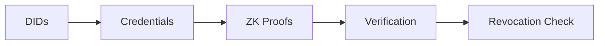
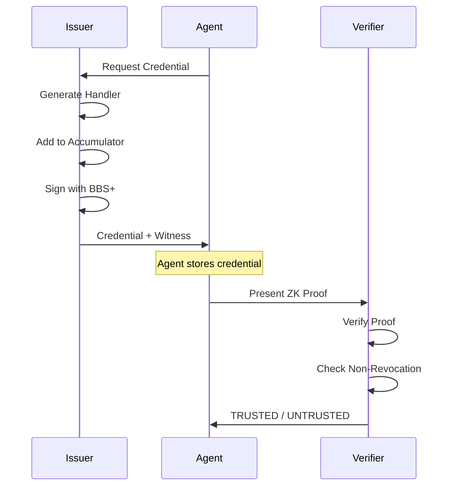
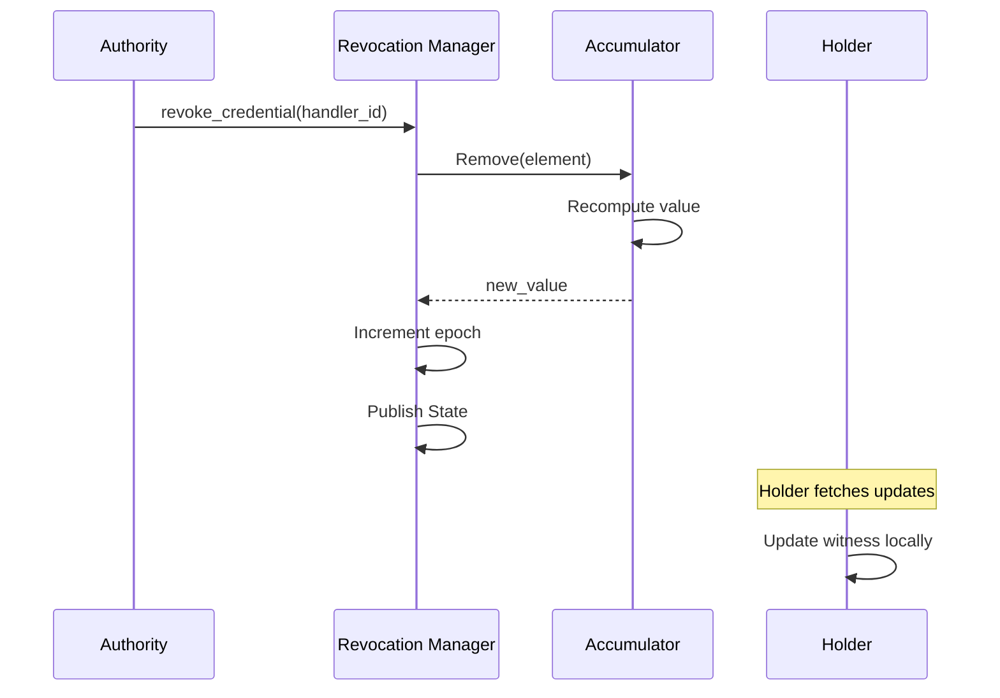

The Identity Layer provides secure, privacy-preserving identification for AI agents using decentralized identifiers, verifiable credentials, and zero-knowledge proofs.

## Components



## Decentralized Identifiers (DIDs)

DIDs provide self-sovereign identity for AI agents following the [W3C DID Core](https://www.w3.org/TR/did-core/) specification.

### DID Format

```
did:arbiter:<method-specific-id>
```

<Note>
The method-specific identifier is deterministically derived from the agent's primary public key—same key always produces the same DID.
</Note>

### DID Document Structure

```json
{
  "@context": ["https://www.w3.org/ns/did/v1"],
  "id": "did:arbiter:2N4Q...",
  "verificationMethod": [
    {
      "id": "did:arbiter:2N4Q...#key-1",
      "type": "Dilithium3VerificationKey2024",
      "controller": "did:arbiter:2N4Q...",
      "publicKeyMultibase": "z..."
    }
  ],
  "authentication": ["did:arbiter:2N4Q...#key-1"],
  "assertionMethod": ["did:arbiter:2N4Q...#assertion-key"]
}
```

### Creating a DID

```python
from arbiter import Identity, DID
from arbiter.identity import DIDDocumentBuilder

# Create key manager
key_manager = Identity.create_key_manager()
auth_key = key_manager.generate_authentication_key()
enc_key = key_manager.generate_encryption_key()
assertion_key = key_manager.generate_assertion_key()

# Create DID from public key
did = DID.from_public_key(auth_key.public_key.public_key_bytes)

# Build DID document
builder = DIDDocumentBuilder(did)
builder.add_authentication_key(auth_key.public_key.public_key_bytes)
builder.add_key_agreement_key(enc_key.public_key.public_key_bytes)
builder.add_assertion_key(assertion_key.public_key.public_key_bytes)

document = builder.build()
```

---

## Verifiable Credentials

Credentials assert claims about an agent, signed by a trusted issuer using **BBS+ signatures**.



### Credential Types

<CardGroup cols={2}>
  <Card title="Agent Identity" icon="robot">
    Core agent identity with name, type, and capabilities
  </Card>
  <Card title="Capability" icon="key">
    Specific permissions and access rights
  </Card>
</CardGroup>

### Issuing a Credential

```python
from arbiter import Identity

# Create issuer
issuer = Identity.create_issuer("did:arbiter:trusted-issuer")

# Issue credential
bundle = issuer.issue_agent_identity_credential(
    subject_did="did:arbiter:agent",
    agent_name="ResearchBot",
    agent_type="researcher",
    capabilities=["search", "analyze", "summarize"],
)

# Bundle contains:
# - credential: The VerifiableCredential
# - witness: For revocation proofs
# - handler_element: Accumulator element
# - raw_signature: BBS+ signature
```

### Credential Structure

```python
VerifiableCredential(
    context=["https://www.w3.org/2018/credentials/v1"],
    id="urn:aegis:cred:abc123",
    type=["VerifiableCredential", "AgentIdentityCredential"],
    issuer="did:arbiter:trusted-issuer",
    issuance_date=datetime.now(UTC),
    credential_subject=CredentialSubject(
        id="did:arbiter:agent",
        claims={
            "agentName": "ResearchBot",
            "agentType": "researcher",
            "capabilities": ["search", "analyze"],
        }
    ),
)
```

---

## Zero-Knowledge Proofs

Agents can prove claims about their credentials without revealing the underlying data.

### What Can Be Proven?

| Proof Type | Description |
|------------|-------------|
| Credential Validity | Agent has a valid credential from a trusted issuer |
| Non-Revocation | Credential has not been revoked |
| Capability Possession | Agent has specific capabilities |
| Selective Disclosure | Reveal only required attributes |

### Selective Disclosure Example

```
Original Credential Claims:
- agentName: "ResearchBot"     [HIDDEN]
- role: "researcher"           [DISCLOSED]
- capabilities: ["search"]     [PROVEN via ZK]
- level: 3                     [HIDDEN]

Verifier learns:
✓ role = "researcher"
✓ Agent has "search" capability (proven, not revealed)
✓ Credential is valid
✓ Credential is not revoked
```

### Creating a Proof

```python
from arbiter.identity import ProofGenerator, create_proof_request, ProofType

# Create proof generator
generator = ProofGenerator(
    credential=bundle.credential,
    bbs_signature=bundle.raw_signature,
    witness=bundle.witness,
)

# Build proof request
request = create_proof_request(
    challenge="unique-challenge",
    domain="verifier.example.com",
    required_proofs=[
        ProofType.CREDENTIAL_VALIDITY,
        ProofType.NON_REVOCATION,
    ],
    required_attributes=["role"],  # Only reveal role
    predicate_requirements={
        "required_capabilities": ["search"],
    },
)

# Generate presentation
presentation = generator.generate_presentation(
    request=request,
    issuer_public_key=issuer.bbs_keypair.public_key,
    accumulator_value=acc_value,
)
```

---

## Revocation System

The revocation system uses **cryptographic accumulators** for instant, O(1) revocation checking.

### 5 Algorithms

| Algorithm | Function | Complexity |
|-----------|----------|------------|
| 1. System Init | Setup accumulator | O(1) |
| 2. Issue | Add handler to accumulator | O(1) |
| 3. Present | Create non-revocation proof | O(1) |
| 4. Revoke | Remove handler from accumulator | O(1) |
| 5. Update | Holder updates witness locally | O(k) updates |

### Revocation Flow



### Using Revocation

```python
from arbiter import Identity

# Revoke a credential
revocation_manager = Identity.create_revocation_manager()
state = revocation_manager.revoke_credential(handler_id)

# Check if revoked
if revocation_manager.is_revoked(handler_id):
    print("Credential has been revoked")
```

---

## Verification Hub

The Verification Hub provides stateless trust verification by combining all proof checks.

```python
from arbiter import Identity

hub = Identity.create_verification_hub()

result = hub.verify_presentation(
    presentation=presentation,
    expected_challenge=request.challenge,
    expected_domain=request.domain,
    issuer_public_key=issuer_pk,
    accumulator_value=acc_value,
)

if result.is_trusted:
    print(f"Verified! Disclosed: {result.disclosed_attributes}")
else:
    print(f"Failed: {result.failure_reason}")
```

### Verification Checks

1. **Challenge Binding**: Proof is bound to the verifier's challenge
2. **Domain Binding**: Proof is intended for this verifier
3. **Validity Proof**: BBS+ signature verification
4. **Non-Revocation**: Accumulator witness check

---

## Next Steps

<CardGroup cols={2}>
  <Card title="Integrity Layer" icon="shield" href="/architecture/integrity-layer">
    Learn about ABAC authorization
  </Card>
  <Card title="Credential Flows" icon="arrows-rotate" href="/flows/credentials">
    See complete credential lifecycle
  </Card>
  <Card title="BBS+ Signatures" icon="signature" href="/cryptography/bbs-plus">
    Understand the signature scheme
  </Card>
  <Card title="Accumulators" icon="database" href="/cryptography/accumulators">
    Deep dive into revocation crypto
  </Card>
</CardGroup>
