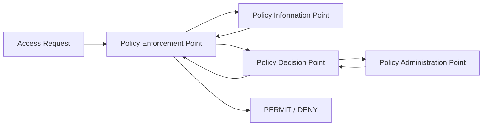
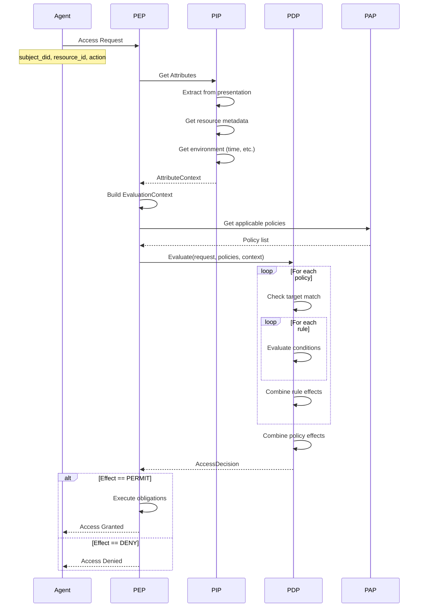
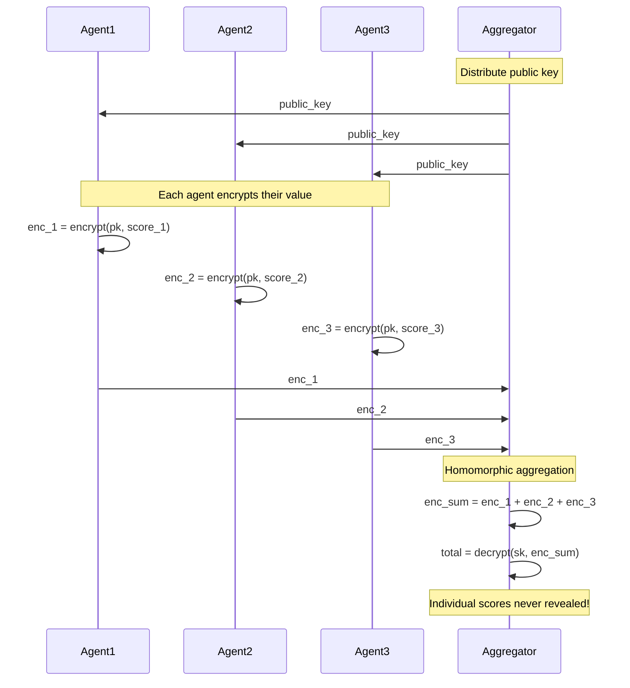

The Integrity Layer enforces authorization policies using Attribute-Based Access Control (ABAC) and enables privacy-preserving computation through homomorphic encryption.

## Components



---

## Attribute-Based Access Control (ABAC)

ABAC provides fine-grained authorization based on attributes extracted from verified credentials.

### Architecture Components

<CardGroup cols={2}>
  <Card title="PEP" icon="shield">
    **Policy Enforcement Point** - Intercepts requests, enforces decisions
  </Card>
  <Card title="PDP" icon="brain">
    **Policy Decision Point** - Evaluates policies, returns decisions
  </Card>
  <Card title="PIP" icon="database">
    **Policy Information Point** - Retrieves attributes from credentials
  </Card>
  <Card title="PAP" icon="gear">
    **Policy Administration Point** - Manages policy lifecycle
  </Card>
</CardGroup>

### Quick Example

```python
from arbiter import Integrity
from arbiter.common import Policy, PolicyRule, Effect, Condition, ConditionOperator

# Create enforcement point
pep = Integrity.create_enforcement_point()

# Define a policy
policy = Policy(
    policy_id="research-access",
    version="1.0",
    target={"resource.type": "research-data"},
    rules=[
        PolicyRule(
            rule_id="researcher-permit",
            effect=Effect.PERMIT,
            conditions=[
                Condition(
                    attribute_category="subject",
                    attribute_id="role",
                    operator=ConditionOperator.EQUALS,
                    value="researcher",
                ),
            ],
        ),
        PolicyRule(
            rule_id="no-delete",
            effect=Effect.DENY,
            conditions=[
                Condition(
                    attribute_category="action",
                    attribute_id="id",
                    operator=ConditionOperator.EQUALS,
                    value="delete",
                ),
            ],
        ),
    ],
)

# Register policy
pap = Integrity.create_policy_admin()
pap.add_policy(policy)

# Enforce access
result = pep.enforce(
    subject_did="did:arbiter:agent",
    resource_id="data/research",
    action="read",
    presentation=presentation,
)

if result.permitted:
    print("✓ Access granted!")
```

### Attribute Categories

| Category | Source | Examples |
|----------|--------|----------|
| `subject` | Agent's credential | role, capabilities, agentType |
| `resource` | Resource metadata | type, sensitivity, owner |
| `action` | Request | read, write, delete, execute |
| `environment` | Runtime | time, location, network |

### Condition Operators

| Operator | Description | Example |
|----------|-------------|---------|
| `EQUALS` | Exact match | `role == "researcher"` |
| `NOT_EQUALS` | Not equal | `action != "delete"` |
| `CONTAINS` | List contains | `capabilities contains "search"` |
| `IN` | Value in list | `role in ["admin", "researcher"]` |
| `GREATER_THAN` | Numeric comparison | `level > 3` |
| `LESS_THAN` | Numeric comparison | `level < 10` |
| `REGEX_MATCH` | Pattern match | `email ~ ".*@company.com"` |

### Policy Combining

When multiple policies apply, their effects are combined:

| Algorithm | Behavior |
|-----------|----------|
| `DENY_OVERRIDES` | Any DENY wins |
| `PERMIT_OVERRIDES` | Any PERMIT wins |
| `FIRST_APPLICABLE` | First matching rule wins |
| `DENY_UNLESS_PERMIT` | Must have explicit PERMIT |

---

## Policy Evaluation Flow



### Evaluation Example

```python
# Subject has: role="researcher", capabilities=["search", "analyze"]
# Wants to access: resource_id="data/research", action="read"

# Policy evaluation:
# 1. Check target: resource.type matches "research-data"? Yes
# 2. Rule "researcher-permit": 
#    - subject.role == "researcher"? Yes
#    - Effect: PERMIT
# 3. Rule "no-delete":
#    - action.id == "delete"? No (it's "read")
#    - Not applicable
# 4. Combine: PERMIT (first applicable)
```

---

## Homomorphic Encryption

Paillier encryption enables privacy-preserving computation—aggregate values without seeing them.

### Supported Operations

| Operation | Formula | Result |
|-----------|---------|--------|
| Addition | `E(a) + E(b)` | `E(a + b)` |
| Scalar Multiply | `E(a) * k` | `E(k·a)` |
| Subtraction | `E(a) + (E(b) * -1)` | `E(a - b)` |

### Privacy-Preserving Aggregation



### Using Paillier Encryption

```python
from arbiter.integrity.homomorphic import (
    generate_keypair,
    encrypt,
    decrypt,
    encrypted_sum,
)

# Setup (aggregator)
keypair = generate_keypair(key_size=2048)

# Each agent encrypts their private value
enc_scores = [
    encrypt(keypair.public_key, 85),  # Agent 1
    encrypt(keypair.public_key, 92),  # Agent 2
    encrypt(keypair.public_key, 78),  # Agent 3
]

# Aggregate without seeing individual values!
enc_total = encrypted_sum(enc_scores)

# Only aggregator can decrypt the total
total = decrypt(keypair.private_key, enc_total)
average = total / len(enc_scores)  # 85

# Individual scores were never revealed
```

### Use Cases

<CardGroup cols={2}>
  <Card title="Trust Aggregation" icon="users">
    Aggregate trust scores without exposing individual ratings
  </Card>
  <Card title="Secure Voting" icon="check-to-slot">
    Tally votes without revealing individual choices
  </Card>
  <Card title="Privacy Metrics" icon="chart-bar">
    Compute statistics on sensitive data
  </Card>
  <Card title="Collaborative ML" icon="brain">
    Aggregate model updates securely
  </Card>
</CardGroup>

---

## Integration with Identity

The Integrity Layer integrates seamlessly with the Identity Layer:

```python
from arbiter import Identity, Integrity

# 1. Agent creates presentation
generator = ProofGenerator(credential, signature, witness)
presentation = generator.generate_presentation(request, ...)

# 2. Verifier checks trust
hub = Identity.create_verification_hub()
trust_result = hub.verify_presentation(presentation, ...)

if trust_result.is_trusted:
    # 3. Enforce access with verified attributes
    pep = Integrity.create_enforcement_point()
    access_result = pep.enforce(
        subject_did=trust_result.subject_did,
        resource_id="sensitive/data",
        action="read",
        presentation=presentation,  # Attributes extracted automatically
    )
    
    if access_result.permitted:
        # Grant access
        pass
```

---

## Next Steps

<CardGroup cols={2}>
  <Card title="Security Model" icon="lock" href="/architecture/security-model">
    Understand threat model and guarantees
  </Card>
  <Card title="Policy Configuration" icon="gear" href="/guides/policy-configuration">
    Learn to configure ABAC policies
  </Card>
  <Card title="Access Control Flow" icon="arrows-rotate" href="/flows/access-control">
    See complete authorization flow
  </Card>
  <Card title="Paillier Crypto" icon="key" href="/cryptography/paillier">
    Deep dive into homomorphic encryption
  </Card>
</CardGroup>
