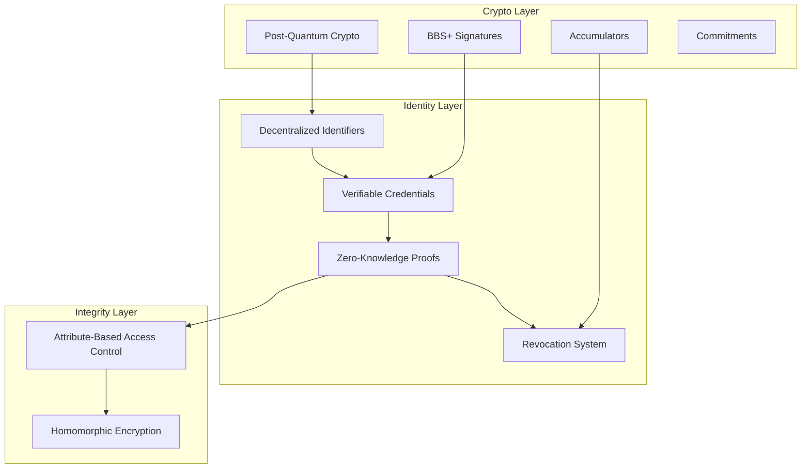
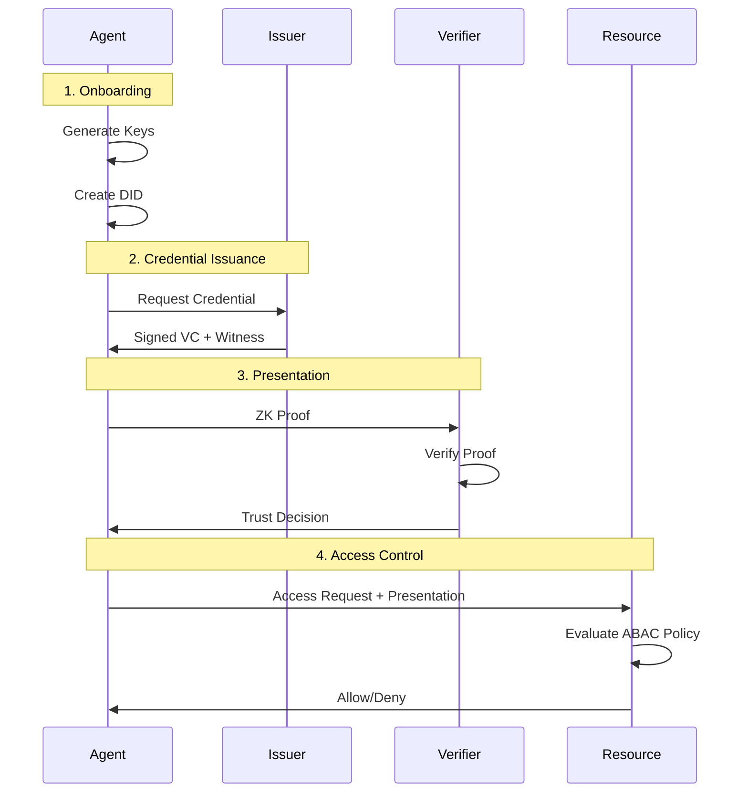

## System Overview

Arbiter is designed as a layered security system that provides both **identity** (authentication) and **integrity** (authorization) guarantees for autonomous AI agents.



## Layer Responsibilities

<CardGroup cols={2}>
  <Card title="Identity Layer" icon="fingerprint">
    Manages **who** agents are and their verifiable attributes
  </Card>
  <Card title="Integrity Layer" icon="shield-check">
    Controls **what** agents can access and do
  </Card>
</CardGroup>

### Identity Layer

| Component | Purpose | Key Technology |
|-----------|---------|----------------|
| DIDs | Self-sovereign identity | Post-Quantum Signatures |
| Verifiable Credentials | Signed attribute claims | BBS+ Signatures |
| Zero-Knowledge Proofs | Privacy-preserving verification | Selective Disclosure |
| Revocation | Instant credential invalidation | Cryptographic Accumulators |

### Integrity Layer

| Component | Purpose | Key Technology |
|-----------|---------|----------------|
| ABAC | Fine-grained authorization | Policy Evaluation Engine |
| Homomorphic Encryption | Secure aggregation | Paillier Cryptosystem |

### Crypto Layer

| Component | Purpose | Standard |
|-----------|---------|----------|
| Dilithium (ML-DSA) | Digital Signatures | NIST FIPS 204 |
| Kyber (ML-KEM) | Key Encapsulation | NIST FIPS 203 |
| BBS+ | Multi-message Signatures | DIF Standard |
| RSA Accumulators | Membership Proofs | Academic Standard |

## Data Flow



## File Structure

```
arbiter/
├── __init__.py           # High-level API (Identity, Integrity classes)
├── common/
│   ├── models.py         # Core data structures
│   ├── errors.py         # Exception hierarchy
│   └── utils.py          # Utilities
├── crypto/
│   ├── pqc.py           # Dilithium + Kyber
│   ├── bbs_plus.py      # BBS+ signatures
│   ├── accumulators.py  # RSA accumulators
│   └── commitments.py   # Commitment schemes
├── identity/
│   ├── did.py           # DID creation/resolution
│   ├── key_management.py # Key lifecycle
│   ├── vc_issuer.py     # Credential issuance
│   ├── zkp_proofs.py    # ZK proof generation
│   ├── verification_hub.py # Trust verification
│   ├── revocation.py    # 5-algorithm revocation
│   └── registry_interface.py # Ledger abstraction
└── integrity/
    ├── policy_models.py # ABAC models
    ├── abac/
    │   ├── pep.py       # Policy Enforcement Point
    │   ├── pdp.py       # Policy Decision Point
    │   ├── pip.py       # Policy Information Point
    │   └── pap.py       # Policy Administration Point
    └── homomorphic/
        └── paillier.py  # Paillier encryption
```

## High-Level API

Arbiter exposes two main convenience classes:

<Tabs>
  <Tab title="Identity">
    ```python
    from arbiter import Identity

    # Key management
    key_manager = Identity.create_key_manager()

    # Credential issuance
    issuer = Identity.create_issuer("did:arbiter:issuer")

    # Verification
    hub = Identity.create_verification_hub()

    # Revocation management
    revocation = Identity.create_revocation_manager()
    ```
  </Tab>
  <Tab title="Integrity">
    ```python
    from arbiter import Integrity

    # Policy enforcement
    pep = Integrity.create_enforcement_point()

    # Policy administration
    pap = Integrity.create_policy_admin()
    ```
  </Tab>
</Tabs>

## Next Steps

<CardGroup cols={2}>
  <Card title="Identity Layer" icon="fingerprint" href="/architecture/identity-layer">
    Deep dive into DIDs, VCs, and ZK Proofs
  </Card>
  <Card title="Integrity Layer" icon="shield-check" href="/architecture/integrity-layer">
    Learn about ABAC and homomorphic encryption
  </Card>
  <Card title="Security Model" icon="lock" href="/architecture/security-model">
    Understand threat model and security guarantees
  </Card>
  <Card title="Cryptography" icon="key" href="/cryptography/pqc">
    Explore the cryptographic primitives
  </Card>
</CardGroup>
