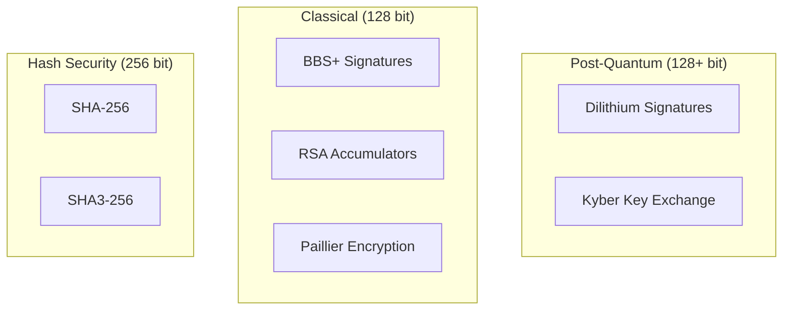

Arbiter is designed with a robust security model that provides strong guarantees against various adversaries while minimizing trust assumptions.

## Design Principles

<CardGroup cols={2}>
  <Card title="Zero-Knowledge by Default" icon="eye-slash">
    Proofs reveal only disclosed attributes—nothing more
  </Card>
  <Card title="Post-Quantum Security" icon="atom">
    Resistant to quantum computer attacks
  </Card>
  <Card title="Instant Revocation" icon="ban">
    O(1) revocation checking, tamper-evident
  </Card>
  <Card title="Minimal Trust" icon="shield-check">
    No central authority, proofs are self-verifying
  </Card>
</CardGroup>

---

## Threat Model

### Adversary Types

<AccordionGroup>
  <Accordion title="Mallory (Spoofing)" icon="mask">
    **Goal**: Forge credentials or impersonate agents
    
    **Mitigation**: Cannot forge credentials without issuer's private key. Post-quantum signatures (Dilithium) provide 128-bit security against quantum adversaries.
    
    ```
    Attack: Create fake credential
    Defense: BBS+ signature verification fails
    Result: Presentation rejected
    ```
  </Accordion>
  
  <Accordion title="Eve (Eavesdropping)" icon="ear-listen">
    **Goal**: Learn private information from proofs
    
    **Mitigation**: Zero-knowledge proofs reveal only disclosed attributes. Hidden attributes remain computationally hidden.
    
    ```
    Attack: Analyze proof to extract hidden data
    Defense: ZK property ensures no information leakage
    Result: Eve learns nothing beyond disclosed values
    ```
  </Accordion>
  
  <Accordion title="Sybil (Multiple Identities)" icon="users">
    **Goal**: Create unlimited fake identities
    
    **Mitigation**: DIDs are bound to unique cryptographic key material. Credentials require trusted issuer.
    
    ```
    Attack: Create many DIDs for Sybil attack
    Defense: Each DID requires credential from trusted issuer
    Result: Sybil limited by issuer's verification
    ```
  </Accordion>
</AccordionGroup>

### Attack Scenarios

| Attack | Vector | Defense | Status |
|--------|--------|---------|--------|
| Credential Forgery | Fake signature | PQC signatures | ✓ Protected |
| Replay Attack | Reuse old proof | Challenge binding | ✓ Protected |
| Cross-Domain | Use proof elsewhere | Domain binding | ✓ Protected |
| Revocation Bypass | Use revoked credential | Accumulator check | ✓ Protected |
| Information Extraction | Analyze proofs | Zero-knowledge | ✓ Protected |
| Quantum Attack | Break signatures | Post-quantum crypto | ✓ Protected |

---

## Security Assumptions

<Warning>
Security depends on these assumptions holding true.
</Warning>

### Cryptographic Assumptions

| Assumption | Component | Confidence |
|------------|-----------|------------|
| M-LWE hardness | Dilithium, Kyber | High (NIST standardized) |
| RSA factoring hardness | Accumulators | High (well-studied) |
| Discrete log hardness | BBS+, Pedersen | High (well-studied) |
| Random oracle model | Hash functions | Standard |

### Operational Assumptions

1. **Issuer Key Security**: Issuer private keys are never compromised
2. **Accumulator Trapdoor**: RSA modulus factorization remains unknown
3. **Secure Randomness**: Cryptographically secure RNG is used
4. **Honest Issuers**: Issuers correctly verify agent claims before signing

---

## Security Properties

### Authentication

| Property | Guarantee | Mechanism |
|----------|-----------|-----------|
| Agent Identity | 128-bit post-quantum | Dilithium signatures |
| Credential Validity | Unforgeable claims | BBS+ signatures |
| Freshness | No replay attacks | Challenge-response |

### Confidentiality

| Property | Guarantee | Mechanism |
|----------|-----------|-----------|
| Key Exchange | 128-bit post-quantum | Kyber encapsulation |
| Attribute Privacy | Hidden unless disclosed | BBS+ selective disclosure |
| Computation Privacy | Values never revealed | Paillier encryption |

### Privacy

| Property | Guarantee | Mechanism |
|----------|-----------|-----------|
| Minimal Disclosure | Only required attributes | Selective disclosure |
| Unlinkability | Proofs cannot be correlated | ZK proofs |
| Holder Binding | Only credential holder can present | Proof of possession |

### Integrity

| Property | Guarantee | Mechanism |
|----------|-----------|-----------|
| Non-repudiation | Signatures are non-forgeable | Digital signatures |
| Tamper Detection | Any modification detected | Cryptographic hashing |
| Revocation Integrity | Cannot hide revocation | Accumulator proofs |

---

## Security Level Summary



| Component | Security Level | Standard |
|-----------|---------------|----------|
| Dilithium | 192-bit PQ (Level 3) | NIST FIPS 204 |
| Kyber | 192-bit PQ (768) | NIST FIPS 203 |
| RSA Accumulator | 112-bit classical | RSA-2048 |
| Paillier | 112-bit classical | 2048-bit keys |
| BBS+ | 128-bit classical | DIF Standard |

---

## Revocation Security

The revocation system provides:

<Steps>
  <Step title="Instant Revocation">
    Revocation takes effect immediately—no propagation delay
  </Step>
  <Step title="Tamper Evidence">
    Cannot hide that a credential was revoked
  </Step>
  <Step title="No Correlation">
    Revoking one credential doesn't reveal information about others
  </Step>
  <Step title="Forward Security">
    Revoked credentials cannot be used even with old proofs
  </Step>
</Steps>

### Revocation Attack Resistance

| Attack | Defense |
|--------|---------|
| Use old witness | Accumulator value changed |
| Forge witness | Requires accumulator trapdoor |
| Hide revocation | All verifiers check same accumulator |
| Denial of service | O(1) verification |

---

## Secure Implementation Guidelines

<Warning>
This implementation uses placeholder cryptography for simulation. Production deployments should use these libraries.
</Warning>

### Recommended Libraries

| Component | Library | Status |
|-----------|---------|--------|
| Dilithium | pqcrypto, liboqs | NIST standardized |
| Kyber | pqcrypto, liboqs | NIST standardized |
| BBS+ | bbs-signatures, mattrglobal | Standards track |
| Paillier | python-paillier, phe | Stable |
| SHA-256 | hashlib, PyCryptodome | Built-in |

### Security Considerations

<AccordionGroup>
  <Accordion title="Key Storage">
    Private keys should never be exposed. Use HSM (Hardware Security Module) or secure enclave for production.
  </Accordion>
  
  <Accordion title="Randomness">
    Always use cryptographically secure random number generators. Never use `random.random()` for cryptographic operations.
  </Accordion>
  
  <Accordion title="Timing Attacks">
    Use constant-time comparison for secrets. Avoid early-exit comparisons that leak information.
  </Accordion>
  
  <Accordion title="Side Channels">
    Be aware of cache timing and power analysis attacks. Use libraries designed with side-channel resistance.
  </Accordion>
</AccordionGroup>

---

## Compliance

Arbiter aligns with these standards:

| Standard | Aspect | Alignment |
|----------|--------|-----------|
| W3C DID Core | DID format | Compliant |
| W3C VC Data Model | Credential structure | Compliant |
| NIST FIPS 203 | Key encapsulation | Kyber |
| NIST FIPS 204 | Signatures | Dilithium |
| NIST SP 800-162 | ABAC | Architecture aligned |

---

## Next Steps

<CardGroup cols={2}>
  <Card title="Architecture Overview" icon="sitemap" href="/architecture/overview">
    Understand system design
  </Card>
  <Card title="Cryptography" icon="key" href="/cryptography/pqc">
    Deep dive into crypto primitives
  </Card>
  <Card title="Protocol Flows" icon="arrows-rotate" href="/flows/onboarding">
    See security in action
  </Card>
  <Card title="API Reference" icon="code" href="/api-reference/identity">
    Explore secure APIs
  </Card>
</CardGroup>
