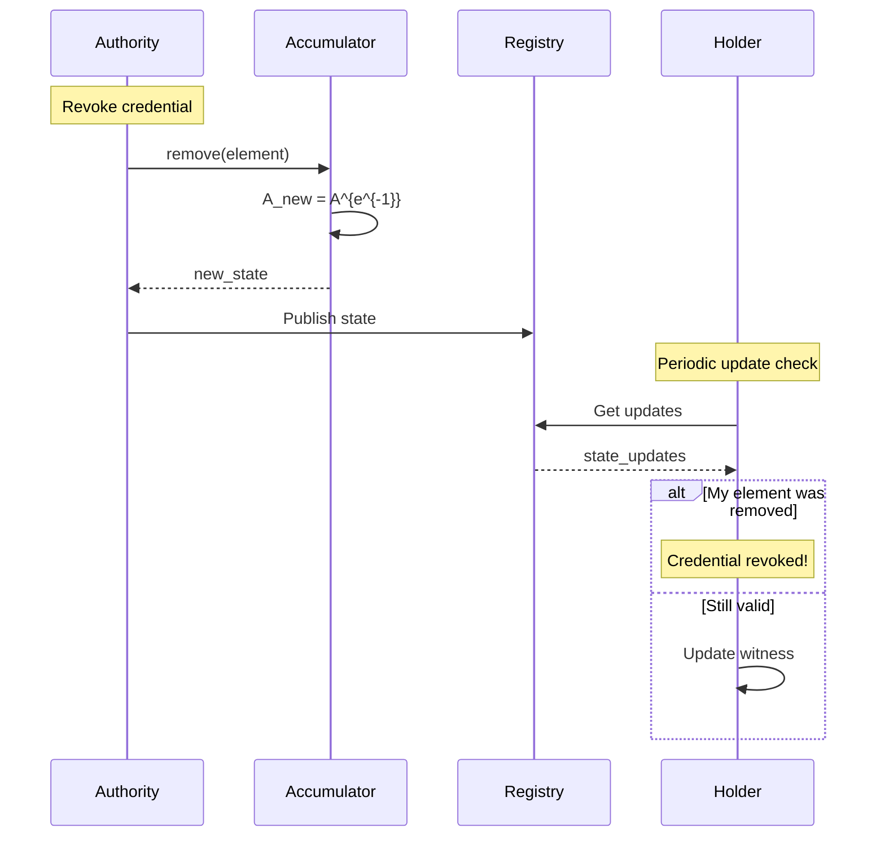

Cryptographic accumulators enable Arbiter's instant revocation system, allowing O(1) verification that a credential has not been revoked.

## Overview

<Info>
An accumulator is a compact representation of a set that supports efficient membership proofs without revealing set contents.
</Info>

### Key Properties

| Property | Value | Benefit |
|----------|-------|---------|
| Accumulator Size | O(1) | Constant regardless of set size |
| Witness Size | O(1) | Constant per element |
| Verify Time | O(1) | Constant verification |
| Add/Remove | O(1) | Constant update time |

---

## RSA Accumulator

Arbiter uses RSA-based accumulators for revocation.

### Setup

```python
# RSA modulus n = p·q (factorization unknown to all)
# Generator g (quadratic residue mod n)
# Initial accumulator value A_0 = g

@dataclass
class AccumulatorPublicParams:
    n: int        # RSA modulus (2048-bit)
    g: int        # Generator
    
@dataclass
class AccumulatorState:
    value: int    # Current accumulator value
    epoch: int    # Update counter
```

### Mathematical Basis

```
Accumulator value: A = g^(e_1 · e_2 · ... · e_k) mod n

Where:
- g is the generator
- e_i are prime elements representing set members
- n is the RSA modulus
```

---

## Operations

### Add Element

When adding element `e` to the accumulator:

```python
def add(state: AccumulatorState, element: int) -> tuple[AccumulatorState, Witness]:
    # New accumulator value
    A_new = pow(state.value, element, params.n)
    
    # Witness for the new element is the old accumulator value
    witness = state.value
    
    return AccumulatorState(value=A_new, epoch=state.epoch + 1), witness
```

```
A_new = A_old^element mod n
witness = A_old
```

### Verify Membership

```python
def verify(params: AccumulatorPublicParams, 
           state: AccumulatorState,
           element: int, 
           witness: int) -> bool:
    # Check: witness^element == A_current
    computed = pow(witness, element, params.n)
    return computed == state.value
```

```
witness^element mod n == A_current
```

### Remove Element

Removing requires the accumulator trapdoor (only issuer has this):

```python
def remove(state: AccumulatorState, element: int, trapdoor) -> AccumulatorState:
    # Compute element inverse mod λ(n)
    element_inv = mod_inverse(element, trapdoor.lambda_n)
    
    # New accumulator value
    A_new = pow(state.value, element_inv, params.n)
    
    return AccumulatorState(value=A_new, epoch=state.epoch + 1)
```

```
A_new = A_old^{element^{-1} mod λ(n)} mod n
```

---

## Witness Updates

When the accumulator changes, holders must update their witnesses.

### After Addition

When element `e_add` is added:

```python
def update_witness_add(witness: int, element_added: int) -> int:
    return pow(witness, element_added, params.n)
```

```
witness_new = witness_old^{added_element} mod n
```

### After Removal

When element `e_rem` is removed (and holder's element `e` is still valid):

```python
def update_witness_remove(witness: int, 
                          my_element: int,
                          removed_element: int,
                          new_accumulator: int) -> int:
    # Find Bezout coefficients: a·my_element + b·removed_element = 1
    a, b = extended_gcd(my_element, removed_element)
    
    # Update witness
    return (pow(witness, a, n) * pow(new_accumulator, b, n)) % n
```

```
witness_new = witness_old^a · A_new^b mod n
where a·element + b·removed_element = 1
```

---

## Element Derivation

Elements must be **prime** for security:

```python
def derive_element(handler_id: str) -> int:
    """Derive a prime element from handler ID."""
    # Hash to candidate
    hash_bytes = sha256(handler_id.encode()).digest()
    candidate = int.from_bytes(hash_bytes, 'big')
    candidate |= 1  # Ensure odd
    
    # Find next prime
    while not is_prime(candidate):
        candidate += 2
    
    return candidate
```

<Warning>
If elements are not prime, the accumulator can be attacked.
</Warning>

---

## Using Accumulators in Arbiter

### Initialize System

```python
from arbiter.crypto import AccumulatorManager

# Initialize with 2048-bit RSA modulus
manager = AccumulatorManager(modulus_bits=2048)
state = manager.initialize()

print(f"Initial accumulator: {state.value}")
print(f"Epoch: {state.epoch}")
```

### Issue Credential (Add to Accumulator)

```python
# When issuing a credential
handler_id = generate_handler_id()
element = manager.derive_element(handler_id)

state, witness = manager.add(state, element)

# Return witness to credential holder
bundle = IssuedCredentialBundle(
    credential=credential,
    witness=witness,
    handler_element=element,
)
```

### Verify Non-Revocation

```python
# Verifier checks accumulator membership
from arbiter.crypto import Witness

is_member = manager.verify_membership(
    state=current_state,
    element=handler_element,
    witness=holder_witness,
)

if is_member:
    print("Credential is NOT revoked")
else:
    print("Credential IS revoked or witness outdated")
```

### Revoke Credential

```python
# Authority revokes credential
new_state = manager.remove(state, handler_element)

# Publish new state
registry.publish_revocation_state(new_state)
```

### Update Witness

```python
from arbiter.crypto import update_witness

# Holder fetches updates
updates = registry.get_updates_since(my_epoch)

# Update witness for each change
for update in updates:
    if update.type == "add":
        witness = update_witness.for_addition(witness, update.element)
    elif update.type == "remove":
        if update.element == my_element:
            raise CredentialRevokedError("My credential was revoked!")
        witness = update_witness.for_removal(
            witness, my_element, update.element, update.new_accumulator
        )
```

---

## Revocation Flow



---

## Non-Membership Proofs

Arbiter also supports proving an element is NOT in the accumulator:

```python
from arbiter.crypto import create_non_membership_proof

# Prove element is not a member
proof = create_non_membership_proof(
    params=params,
    state=state,
    element=element_to_check,
)

# Verify non-membership
is_non_member = verify_non_membership(params, state, element, proof)
```

---

## Security Properties

### Collision Resistance

Cannot find different witness for same element:

```
Given: A, e
Cannot find: w' ≠ w such that w'^e = A
```

### Witness Forgery Resistance

Cannot create witness without trapdoor:

```
Given: A, e (not in set)
Cannot find: w such that w^e = A
```

### Trapdoor Security

Security depends on RSA assumption:

```
Given: n = p·q, A, e
Cannot find: A^{1/e} without knowing p, q
```

---

## API Reference

### Types

```python
@dataclass
class AccumulatorPublicParams:
    n: int  # RSA modulus
    g: int  # Generator

@dataclass
class AccumulatorState:
    value: int
    epoch: int

@dataclass
class Witness:
    value: int
    element: int
    epoch: int
```

### Functions

| Function | Description |
|----------|-------------|
| `AccumulatorManager(bits)` | Initialize with modulus size |
| `add(state, element)` | Add element, return witness |
| `remove(state, element)` | Remove element (requires trapdoor) |
| `verify_membership(state, element, witness)` | Check membership |
| `update_witness(witness, updates)` | Update witness for changes |

---

## Next Steps

<CardGroup cols={2}>
  <Card title="Commitments" icon="lock" href="/cryptography/commitments">
    Hash and Pedersen commitments
  </Card>
  <Card title="Revocation Flow" icon="ban" href="/flows/revocation">
    Complete revocation protocol
  </Card>
</CardGroup>
