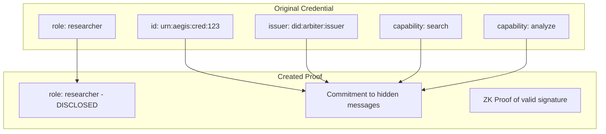

BBS+ signatures are the foundation of Arbiter's privacy-preserving credential system, enabling selective disclosure of credential attributes.

## Overview

<Info>
BBS+ allows signing multiple messages with a single signature, then proving knowledge of that signature while revealing only selected messages.
</Info>

### Key Capabilities

<CardGroup cols={2}>
  <Card title="Multi-Message Signing" icon="layer-group">
    Sign multiple attributes with one signature
  </Card>
  <Card title="Selective Disclosure" icon="eye-slash">
    Reveal only required attributes
  </Card>
  <Card title="Zero-Knowledge Proofs" icon="shield-halved">
    Prove signature possession without revealing it
  </Card>
  <Card title="Unlinkability" icon="link-slash">
    Proofs from same credential can't be correlated
  </Card>
</CardGroup>

---

## Key Structure

### Public Key

```python
@dataclass
class BBSPublicKey:
    w: bytes          # Commitment to private key (group element)
    generators: list  # [h_1, h_2, ..., h_n] for n messages
```

### Private Key

```python
@dataclass
class BBSPrivateKey:
    x: bytes  # Scalar (secret key)
```

---

## Signature Algorithm

### Sign(sk, messages)

```python
def bbs_sign(private_key: BBSPrivateKey, messages: list[bytes]) -> BBSSignature:
    # 1. Generate random scalars e, s
    e = random_scalar()
    s = random_scalar()
    
    # 2. Compute B = g_1 · h_0^s · ∏(h_i^{m_i})
    B = g1 * h0**s
    for i, m in enumerate(messages):
        B *= h[i]**hash_to_scalar(m)
    
    # 3. Compute A = B^{1/(x+e)}
    A = B ** mod_inverse(x + e)
    
    # 4. Return signature
    return BBSSignature(A=A, e=e, s=s)
```

### Verify(pk, messages, σ)

```python
def bbs_verify(public_key: BBSPublicKey, messages: list[bytes], signature: BBSSignature) -> bool:
    # 1. Reconstruct B from messages
    B = reconstruct_B(messages, signature.s)
    
    # 2. Check pairing equation: e(A, w · g_2^e) = e(B, g_2)
    lhs = pairing(signature.A, public_key.w * g2**signature.e)
    rhs = pairing(B, g2)
    
    return lhs == rhs
```

---

## Using BBS+ in Arbiter

### Key Generation

```python
from arbiter.crypto import generate_bbs_keypair

# Generate keypair for up to 10 messages
keypair = generate_bbs_keypair(max_messages=10)

print(f"Can sign up to {keypair.max_messages} messages")
```

### Signing Messages

```python
from arbiter.crypto import bbs_sign

# Credential as list of messages
messages = [
    b"id:urn:aegis:cred:123",
    b"issuer:did:arbiter:issuer",
    b"role:researcher",
    b"capability:search",
    b"capability:analyze",
]

signature = bbs_sign(keypair.private_key, messages)
```

### Verification

```python
from arbiter.crypto import bbs_verify

is_valid = bbs_verify(keypair.public_key, messages, signature)
print(f"Signature valid: {is_valid}")  # True
```

---

## Selective Disclosure

The power of BBS+ is proving signature possession while revealing only selected messages.

### Creating a Proof

```python
from arbiter.crypto import bbs_create_proof

# Reveal only the "role" message (index 2)
proof = bbs_create_proof(
    keypair.public_key,
    signature,
    messages,
    disclosed_indices=[2],  # Only reveal role
    nonce=challenge_from_verifier,
)
```

### What the Proof Contains



### Verifying a Proof

```python
from arbiter.crypto import bbs_verify_proof

is_valid = bbs_verify_proof(
    keypair.public_key,
    proof,
    total_message_count=5,  # Total messages in original credential
)

if is_valid:
    print("Proof is valid!")
    print(f"Disclosed values: {proof.disclosed_messages}")
```

---

## Proof Request and Response

### Verifier Creates Request

```python
request = ProofRequest(
    challenge=generate_challenge(),
    domain="verifier.example.com",
    required_attributes=["role"],  # Must reveal role
    predicate_requirements={
        "required_capabilities": ["search"],  # Must prove, not reveal
    },
)
```

### Holder Creates Proof

```python
# Selective disclosure: reveal role, prove capabilities via ZK
presentation = generator.generate_presentation(
    request=request,
    issuer_public_key=issuer_pk,
    accumulator_value=acc_value,
)
```

### What Verifier Learns

| Attribute | Status | Verifier Learns |
|-----------|--------|----------------|
| id | Hidden | Nothing |
| issuer | Hidden | Nothing |
| role | Disclosed | "researcher" |
| capability:search | Proven | Has it (not value) |
| capability:analyze | Hidden | Nothing |

---

## Security Properties

### Unlinkability

Multiple proofs from the same credential cannot be linked:

```python
# Same credential, different proofs
proof1 = create_proof(credential, nonce1)
proof2 = create_proof(credential, nonce2)

# proof1 and proof2 cannot be correlated
# (assuming different nonces)
```

### Zero-Knowledge

Hidden messages are computationally hidden:

```
Given: proof, disclosed_messages, nonce
Cannot determine: hidden_messages
```

### Signature Unforgeability

Cannot create valid proof without valid signature:

```
Given: public_key, some_messages
Cannot create: valid proof without knowing signature
```

---

## Message Encoding

Arbiter encodes credential attributes as BBS+ messages:

```python
def encode_credential(credential: VerifiableCredential) -> list[bytes]:
    messages = [
        credential.id.encode(),                           # Index 0
        credential.issuer.encode(),                       # Index 1
        credential.issuance_date.isoformat().encode(),   # Index 2
        credential.credential_subject.id.encode(),        # Index 3
    ]
    
    # Add claims (sorted by key for determinism)
    for key, value in sorted(credential.credential_subject.claims.items()):
        messages.append(f"{key}:{value}".encode())
    
    return messages
```

---

## API Reference

### Types

```python
@dataclass
class BBSSignature:
    A: bytes  # Signature component
    e: bytes  # Scalar
    s: bytes  # Scalar

@dataclass  
class BBSProof:
    disclosed_indices: list[int]
    disclosed_messages: list[bytes]
    proof_bytes: bytes
    nonce: bytes
```

### Functions

| Function | Description |
|----------|-------------|
| `generate_bbs_keypair(max_messages)` | Generate BBS+ keypair |
| `bbs_sign(sk, messages)` | Sign multiple messages |
| `bbs_verify(pk, messages, sig)` | Verify signature |
| `bbs_create_proof(pk, sig, msgs, disclosed, nonce)` | Create selective disclosure proof |
| `bbs_verify_proof(pk, proof, count)` | Verify proof |

---

## Next Steps

<CardGroup cols={2}>
  <Card title="Accumulators" icon="database" href="/cryptography/accumulators">
    Revocation with cryptographic accumulators
  </Card>
  <Card title="Credential Flows" icon="arrows-rotate" href="/flows/credentials">
    See BBS+ in credential lifecycle
  </Card>
</CardGroup>
