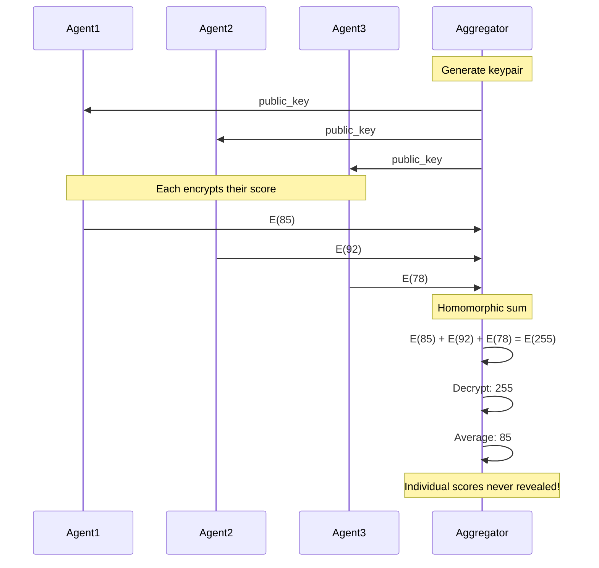

Paillier encryption enables computation on encrypted data, allowing aggregation without revealing individual values.

## Overview

<Info>
Paillier encryption is **additively homomorphic**: you can add encrypted values and get the encrypted sum.
</Info>

### Key Operations

| Operation | Plaintext | Ciphertext |
|-----------|-----------|------------|
| Addition | `a + b` | `E(a) · E(b) = E(a + b)` |
| Scalar Multiply | `k · a` | `E(a)^k = E(k·a)` |
| Subtraction | `a - b` | `E(a) · E(b)^{-1} = E(a - b)` |

---

## Key Generation

```python
from arbiter.integrity.homomorphic import generate_keypair

# Generate 2048-bit keypair
keypair = generate_keypair(key_size=2048)

# Public key: (n, g) - share with everyone
print(f"Modulus bits: {keypair.public_key.n.bit_length()}")

# Private key: (λ, μ) - keep secret
# Only holder can decrypt
```

### Key Structure

```python
@dataclass
class PaillierPublicKey:
    n: int      # RSA-style modulus
    g: int      # Generator (typically n + 1)
    n_squared: int  # n² for mod operations

@dataclass
class PaillierPrivateKey:
    lambda_: int  # λ = lcm(p-1, q-1)
    mu: int       # μ = L(g^λ mod n²)^{-1} mod n
    public_key: PaillierPublicKey
```

### Generation Algorithm

```
1. Generate primes p, q (each key_size/2 bits)
2. n = p · q
3. λ = lcm(p-1, q-1)
4. g = n + 1 (simplified generator)
5. μ = L(g^λ mod n²)^{-1} mod n
   where L(x) = (x-1)/n

Public key: (n, g)
Private key: (λ, μ)
```

---

## Encryption

```python
from arbiter.integrity.homomorphic import encrypt

# Encrypt a message (plaintext integer)
message = 42
encrypted = encrypt(keypair.public_key, message)

print(f"Ciphertext: {encrypted.ciphertext}")
# Ciphertext appears random to anyone without private key
```

### Encryption Algorithm

```
Encrypt(pk, m):
    r ← random in [1, n)
    c = g^m · r^n mod n²

With g = n + 1:
    g^m = (1 + n)^m = 1 + n·m mod n²
    c = (1 + n·m) · r^n mod n²
```

<Note>
Each encryption uses fresh randomness, so encrypting the same value twice produces different ciphertexts.
</Note>

---

## Decryption

```python
from arbiter.integrity.homomorphic import decrypt

# Decrypt (requires private key)
decrypted = decrypt(keypair.private_key, encrypted)

print(f"Decrypted: {decrypted}")  # 42
assert decrypted == message
```

### Decryption Algorithm

```
Decrypt(sk, c):
    m = L(c^λ mod n²) · μ mod n
    where L(x) = (x-1)/n
```

---

## Homomorphic Operations

### Addition

```python
# Encrypt two values
enc_a = encrypt(pk, 10)
enc_b = encrypt(pk, 32)

# Add encrypted values
enc_sum = enc_a + enc_b  # Uses __add__ method
# Equivalent to: enc_sum = homomorphic_add(enc_a, enc_b)

# Decrypt the sum
total = decrypt(sk, enc_sum)
print(f"Sum: {total}")  # 42
```

```
E(a) + E(b) = E(a) · E(b) mod n² = E(a + b)
```

### Scalar Multiplication

```python
# Encrypt a value
enc_a = encrypt(pk, 10)

# Multiply by scalar (plaintext)
enc_scaled = enc_a * 5  # Uses __mul__ method

# Decrypt
scaled = decrypt(sk, enc_scaled)
print(f"Scaled: {scaled}")  # 50
```

```
E(a) * k = E(a)^k mod n² = E(k·a)
```

### Subtraction

```python
enc_a = encrypt(pk, 100)
enc_b = encrypt(pk, 42)

# Subtract: add the negation
enc_diff = enc_a + (enc_b * -1)

diff = decrypt(sk, enc_diff)
print(f"Difference: {diff}")  # 58
```

---

## Privacy-Preserving Aggregation

The primary use case: aggregate values without seeing them.



### Implementation

```python
from arbiter.integrity.homomorphic import (
    generate_keypair,
    encrypt,
    decrypt,
    encrypted_sum,
)

# Aggregator creates keypair
keypair = generate_keypair(key_size=2048)
pk = keypair.public_key
sk = keypair.private_key

# Each agent encrypts their private score
agent_scores = [85, 92, 78]  # Private values
encrypted_scores = [encrypt(pk, score) for score in agent_scores]

# Aggregate without seeing individual values
enc_total = encrypted_sum(encrypted_scores)

# Only aggregator decrypts total
total = decrypt(sk, enc_total)
average = total / len(agent_scores)

print(f"Total: {total}")    # 255
print(f"Average: {average}")  # 85.0

# Individual scores were NEVER revealed to aggregator!
```

---

## Use Cases

<CardGroup cols={2}>
  <Card title="Trust Score Aggregation" icon="users">
    Aggregate reputation scores without exposing individual ratings
  </Card>
  <Card title="Secure Voting" icon="check-to-slot">
    Tally votes while keeping individual votes private
  </Card>
  <Card title="Privacy Metrics" icon="chart-bar">
    Compute statistics on sensitive data without access
  </Card>
  <Card title="Federated Learning" icon="brain">
    Aggregate model updates from multiple clients securely
  </Card>
</CardGroup>

### Trust Aggregation Example

```python
# Multi-agent trust evaluation
# Each agent rates the target, but individual ratings are private

def aggregate_trust_ratings(target_agent: str, raters: list) -> float:
    keypair = generate_keypair()
    
    # Each rater encrypts their rating (0-100)
    encrypted_ratings = []
    for rater in raters:
        rating = rater.get_trust_rating(target_agent)  # Private
        encrypted_ratings.append(encrypt(keypair.public_key, rating))
    
    # Aggregate
    enc_total = encrypted_sum(encrypted_ratings)
    total = decrypt(keypair.private_key, enc_total)
    
    return total / len(raters)  # Average trust score
```

---

## Security Properties

### Semantic Security

Paillier is **semantically secure** under the Decisional Composite Residuosity Assumption (DCRA):

```
Given: E(m) for unknown m
Cannot determine: any information about m
```

### Randomization

Same plaintext produces different ciphertexts:

```python
enc1 = encrypt(pk, 42)
enc2 = encrypt(pk, 42)

assert enc1.ciphertext != enc2.ciphertext
# But both decrypt to 42
```

### Key Size Recommendations

| Security Level | Key Size | Performance |
|---------------|----------|-------------|
| 80-bit | 1024-bit | Fast |
| 112-bit | 2048-bit | **Recommended** |
| 128-bit | 3072-bit | Slower |

---

## Limitations

<Warning>
Paillier only supports **addition** and **scalar multiplication**. For more complex operations (multiplication of ciphertexts), consider fully homomorphic encryption.
</Warning>

| Operation | Supported | Notes |
|-----------|-----------|-------|
| Addition | ✓ | `E(a) + E(b) = E(a+b)` |
| Scalar Multiply | ✓ | `E(a) * k = E(k·a)` |
| Subtraction | ✓ | Via scalar multiply by -1 |
| Multiplication | ✗ | Cannot compute E(a·b) |
| Division | ✗ | Cannot compute E(a/b) |

---

## API Reference

### Types

```python
@dataclass
class PaillierPublicKey:
    n: int
    g: int
    n_squared: int

@dataclass
class PaillierPrivateKey:
    lambda_: int
    mu: int
    public_key: PaillierPublicKey

@dataclass
class PaillierKeyPair:
    public_key: PaillierPublicKey
    private_key: PaillierPrivateKey

@dataclass
class EncryptedNumber:
    ciphertext: int
    public_key: PaillierPublicKey
    
    def __add__(self, other): ...  # Homomorphic addition
    def __mul__(self, scalar): ...  # Scalar multiplication
```

### Functions

| Function | Description |
|----------|-------------|
| `generate_keypair(key_size)` | Generate Paillier keypair |
| `encrypt(pk, message)` | Encrypt integer |
| `decrypt(sk, encrypted)` | Decrypt to integer |
| `encrypted_sum(encrypted_list)` | Sum multiple encrypted values |

---

## Next Steps

<CardGroup cols={2}>
  <Card title="Integrity Layer" icon="shield" href="/architecture/integrity-layer">
    See Paillier in ABAC context
  </Card>
  <Card title="Privacy Aggregation Flow" icon="arrows-rotate" href="/flows/access-control">
    Complete aggregation protocol
  </Card>
</CardGroup>
