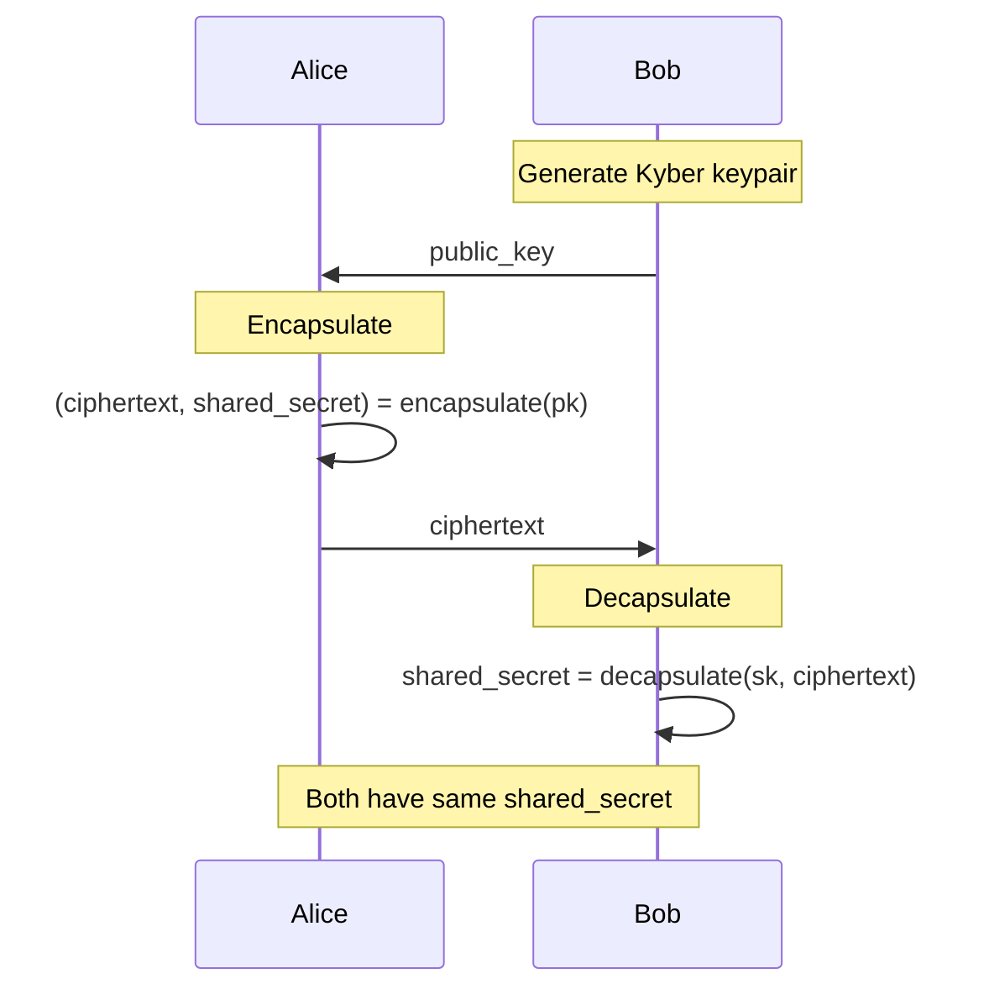
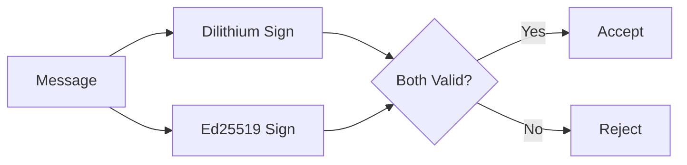

Arbiter uses NIST-standardized post-quantum cryptographic algorithms to ensure security against quantum computer attacks.

## Overview

<Info>
All Arbiter signatures and key exchanges are quantum-resistant by default.
</Info>

| Algorithm | Purpose | Standard |
|-----------|---------|----------|
| ML-DSA (Dilithium) | Digital Signatures | NIST FIPS 204 |
| ML-KEM (Kyber) | Key Encapsulation | NIST FIPS 203 |

---

## ML-DSA (Dilithium) - Digital Signatures

Dilithium provides post-quantum secure digital signatures for agent authentication and credential signing.

### Security Levels

| Level | NIST Category | Public Key | Signature | Security |
|-------|---------------|------------|-----------|----------|
| 2 | 1 | 1,312 bytes | 2,420 bytes | 128-bit PQ |
| **3** | 3 | 1,952 bytes | 3,293 bytes | 192-bit PQ |
| 5 | 5 | 2,592 bytes | 4,595 bytes | 256-bit PQ |

<Note>
Arbiter uses **Level 3** (NIST Category 3) by default for 192-bit post-quantum security.
</Note>

### Key Generation

```python
from arbiter.crypto import generate_dilithium_keypair

# Generate keypair (default: Level 3)
keypair = generate_dilithium_keypair(security_level=3)

print(f"Public key size: {len(keypair.public_key.public_key_bytes)} bytes")
print(f"Private key size: {len(keypair.private_key.private_key_bytes)} bytes")
```

### Signing and Verification

```python
from arbiter.crypto import dilithium_sign, dilithium_verify

# Sign a message
message = b"Agent authentication challenge"
signature = dilithium_sign(keypair.private_key, message)

# Verify the signature
is_valid = dilithium_verify(keypair.public_key, message, signature)
print(f"Signature valid: {is_valid}")  # True
```

### Security Basis

Dilithium's security is based on the **Module Learning with Errors (M-LWE)** problem:

```
Given: A, b = A·s + e (mod q)
Find: s

Where:
- A is a random matrix
- s is the secret
- e is a small error term
```

This problem is believed to be hard even for quantum computers.

---

## ML-KEM (Kyber) - Key Encapsulation

Kyber provides post-quantum secure key exchange for establishing shared secrets.

### Security Levels

| Level | NIST Category | Public Key | Ciphertext | Shared Secret |
|-------|---------------|------------|------------|---------------|
| 512 | 1 | 800 bytes | 768 bytes | 32 bytes |
| **768** | 3 | 1,184 bytes | 1,088 bytes | 32 bytes |
| 1024 | 5 | 1,568 bytes | 1,568 bytes | 32 bytes |

<Note>
Arbiter uses **Kyber768** (NIST Category 3) by default.
</Note>

### Key Generation

```python
from arbiter.crypto import generate_kyber_keypair

# Generate keypair
keypair = generate_kyber_keypair(security_level=3)  # Kyber768
```

### Encapsulation and Decapsulation

```python
from arbiter.crypto import kyber_encapsulate, kyber_decapsulate

# Sender: Encapsulate a shared secret
result = kyber_encapsulate(keypair.public_key)
ciphertext = result.ciphertext
shared_secret_sender = result.shared_secret

# Send ciphertext to recipient...

# Recipient: Decapsulate to get the same shared secret
shared_secret_recipient = kyber_decapsulate(keypair.private_key, ciphertext)

# Both parties now have the same 32-byte shared secret
assert shared_secret_sender == shared_secret_recipient
```

### Usage Pattern



---

## Hybrid Mode

For transitional security, Arbiter supports hybrid signatures combining post-quantum and classical algorithms:

```python
from arbiter.crypto import generate_hybrid_keypair

# Generate hybrid keypair (Dilithium + Ed25519)
hybrid = generate_hybrid_keypair()

# Both signatures must verify
```

### Hybrid Signature Verification



<Warning>
Hybrid mode is for transitional deployments. Use pure PQC for maximum security.
</Warning>

---

## Security Parameters

### Recommended Defaults

| Parameter | Default | Reasoning |
|-----------|---------|-----------|
| Dilithium Level | 3 | Balance of security and size |
| Kyber Level | 768 | Matches Dilithium Level 3 |
| Nonce Length | 256-bit | 128-bit collision resistance |

### Key Lifecycle

<Steps>
  <Step title="Generation">
    Generate fresh key material using secure randomness
  </Step>
  <Step title="Storage">
    Store private keys in HSM or secure enclave (production)
  </Step>
  <Step title="Usage">
    Use keys for intended purpose only (signing OR encryption)
  </Step>
  <Step title="Rotation">
    Rotate keys periodically (recommended: annually)
  </Step>
  <Step title="Destruction">
    Securely destroy old key material after rotation
  </Step>
</Steps>

---

## API Reference

### Types

```python
@dataclass
class DilithiumPublicKey:
    public_key_bytes: bytes
    security_level: int

@dataclass
class DilithiumPrivateKey:
    private_key_bytes: bytes
    security_level: int

@dataclass
class DilithiumKeyPair:
    public_key: DilithiumPublicKey
    private_key: DilithiumPrivateKey
```

### Functions

| Function | Description |
|----------|-------------|
| `generate_dilithium_keypair(level)` | Generate Dilithium keypair |
| `dilithium_sign(sk, msg)` | Sign message |
| `dilithium_verify(pk, msg, sig)` | Verify signature |
| `generate_kyber_keypair(level)` | Generate Kyber keypair |
| `kyber_encapsulate(pk)` | Create shared secret |
| `kyber_decapsulate(sk, ct)` | Recover shared secret |

---

## Next Steps

<CardGroup cols={2}>
  <Card title="BBS+ Signatures" icon="signature" href="/cryptography/bbs-plus">
    Multi-message signatures with selective disclosure
  </Card>
  <Card title="Accumulators" icon="database" href="/cryptography/accumulators">
    Cryptographic accumulators for revocation
  </Card>
</CardGroup>
