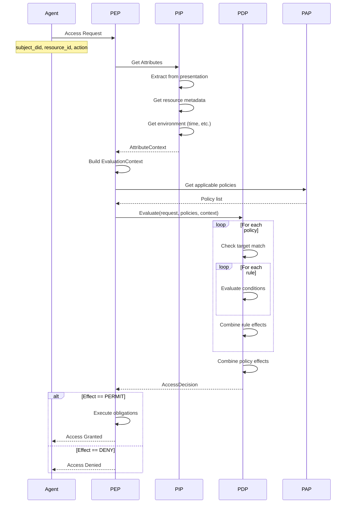

Arbiter uses Attribute-Based Access Control (ABAC) to make fine-grained authorization decisions based on verified credential attributes.

## Flow Overview



---

## Access Request

An agent requests access to a resource:

```python
from arbiter import Integrity

pep = Integrity.create_enforcement_point()

result = pep.enforce(
    subject_did="did:arbiter:agent",
    resource_id="data/research-papers",
    action="read",
    presentation=presentation,  # Verified credential presentation
)
```

### Request Components

| Component | Description | Example |
|-----------|-------------|---------|
| `subject_did` | Agent's DID | `did:arbiter:agent` |
| `resource_id` | Resource being accessed | `data/research` |
| `action` | Requested operation | `read`, `write`, `delete` |
| `presentation` | Credential presentation | ZK proof |

---

## Attribute Extraction

The PIP extracts attributes from multiple sources:

```python
from arbiter.integrity import PolicyInformationPoint

pip = PolicyInformationPoint()

# Get all relevant attributes
context = pip.get_attributes(
    subject_did=subject_did,
    resource_id=resource_id,
    action=action,
    presentation=presentation,
)

print(f"Subject attributes: {context.subject}")
print(f"Resource attributes: {context.resource}")
print(f"Action attributes: {context.action}")
print(f"Environment: {context.environment}")
```

### Attribute Categories

<CardGroup cols={2}>
  <Card title="Subject" icon="user">
    From credential: role, capabilities, agentType
  </Card>
  <Card title="Resource" icon="folder">
    Metadata: type, sensitivity, owner, location
  </Card>
  <Card title="Action" icon="bolt">
    Request: id, parameters
  </Card>
  <Card title="Environment" icon="clock">
    Runtime: time, network, geolocation
  </Card>
</CardGroup>

---

## Policy Definition

Policies are defined using the PAP:

```python
from arbiter import Integrity
from arbiter.common import (
    Policy, PolicyRule, Effect, 
    Condition, ConditionOperator
)

pap = Integrity.create_policy_admin()

policy = Policy(
    policy_id="research-access",
    version="1.0",
    target={"resource.type": "research-data"},
    combining_algorithm="FIRST_APPLICABLE",
    rules=[
        PolicyRule(
            rule_id="researcher-permit",
            effect=Effect.PERMIT,
            conditions=[
                Condition(
                    attribute_category="subject",
                    attribute_id="role",
                    operator=ConditionOperator.EQUALS,
                    value="researcher",
                ),
            ],
        ),
        PolicyRule(
            rule_id="no-delete",
            effect=Effect.DENY,
            conditions=[
                Condition(
                    attribute_category="action",
                    attribute_id="id",
                    operator=ConditionOperator.EQUALS,
                    value="delete",
                ),
            ],
        ),
    ],
)

pap.add_policy(policy)
```

---

## Policy Evaluation

The PDP evaluates policies against the attribute context:

```python
from arbiter.integrity import PolicyDecisionPoint

pdp = PolicyDecisionPoint()

decision = pdp.evaluate(
    policies=applicable_policies,
    context=attribute_context,
)

print(f"Decision: {decision.effect}")  # PERMIT or DENY
print(f"Reason: {decision.reason}")
print(f"Applicable rule: {decision.rule_id}")
```

### Evaluation Steps

<Steps>
  <Step title="Target Matching">
    Check if policy target matches the request
  </Step>
  <Step title="Rule Evaluation">
    Evaluate each rule's conditions against attributes
  </Step>
  <Step title="Rule Combining">
    Combine rule effects using policy's algorithm
  </Step>
  <Step title="Policy Combining">
    Combine multiple policy decisions
  </Step>
</Steps>

---

## Condition Evaluation Example

```python
# Request context:
# - subject.role = "researcher"
# - action.id = "read"
# - resource.type = "research-data"

# Policy evaluation:

# 1. Check target: resource.type == "research-data"? 
#    ✓ Yes, policy applies

# 2. Rule "researcher-permit": 
#    Condition: subject.role == "researcher"?
#    ✓ Yes → Effect: PERMIT

# 3. Rule "no-delete":
#    Condition: action.id == "delete"?
#    ✗ No (it's "read") → Rule not applicable

# 4. First applicable rule: researcher-permit
# 5. Final decision: PERMIT
```

---

## Combining Algorithms

| Algorithm | Behavior | Use Case |
|-----------|----------|----------|
| `DENY_OVERRIDES` | Any DENY wins | Fail-safe default |
| `PERMIT_OVERRIDES` | Any PERMIT wins | Permissive systems |
| `FIRST_APPLICABLE` | First matching rule wins | Ordered policies |
| `DENY_UNLESS_PERMIT` | Must have explicit PERMIT | Whitelist approach |

---

## Complete Example

```python
from arbiter import Identity, Integrity
from arbiter.common import Policy, PolicyRule, Effect, Condition, ConditionOperator
from arbiter.identity import ProofGenerator, create_proof_request

# === SETUP ===
issuer = Identity.create_issuer("did:arbiter:issuer")
bundle = issuer.issue_agent_identity_credential(
    subject_did="did:arbiter:agent",
    agent_name="ResearchBot",
    agent_type="researcher",
    capabilities=["search", "analyze"],
)

# === DEFINE POLICY ===
pap = Integrity.create_policy_admin()
pap.add_policy(Policy(
    policy_id="research-access",
    target={"resource.type": "research-data"},
    rules=[
        PolicyRule(
            rule_id="researcher-read",
            effect=Effect.PERMIT,
            conditions=[
                Condition("subject", "agentType", ConditionOperator.EQUALS, "researcher"),
                Condition("action", "id", ConditionOperator.IN, ["read", "search"]),
            ],
        ),
    ],
))

# === CREATE PRESENTATION ===
generator = ProofGenerator(
    credential=bundle.credential,
    bbs_signature=bundle.raw_signature,
    witness=bundle.witness,
)

presentation = generator.generate_presentation(
    request=create_proof_request(
        challenge="access-challenge",
        required_attributes=["agentType"],  # Disclose for ABAC
    ),
    issuer_public_key=issuer.bbs_keypair.public_key,
    accumulator_value=issuer.revocation_manager.get_current_accumulator(),
)

# === ENFORCE ACCESS ===
pep = Integrity.create_enforcement_point()

result = pep.enforce(
    subject_did="did:arbiter:agent",
    resource_id="data/research-papers",
    action="read",
    presentation=presentation,
)

if result.permitted:
    print("✓ Access granted!")
    print(f"  Rule: {result.applied_rule}")
else:
    print(f"✗ Access denied: {result.reason}")
```

---

## Audit Logging

Access decisions are logged for audit:

```python
# Audit log entry
{
    "timestamp": "2024-01-15T10:30:00Z",
    "subject_did": "did:arbiter:agent",
    "resource_id": "data/research-papers",
    "action": "read",
    "decision": "PERMIT",
    "applied_rule": "researcher-read",
    "policy_id": "research-access",
    "attributes_used": ["agentType"],
}
```

---

## Error Handling

```python
result = pep.enforce(
    subject_did=agent_did,
    resource_id=resource_id,
    action=action,
    presentation=presentation,
)

if result.permitted:
    # Grant access
    return access_resource(resource_id)
elif result.error:
    # Evaluation error
    log.error(f"Policy evaluation failed: {result.error}")
    raise AuthorizationError(result.error)
else:
    # Explicit denial
    log.warn(f"Access denied: {result.reason}")
    raise AccessDeniedError(result.reason)
```

---

## Next Steps

<CardGroup cols={2}>
  <Card title="Policy Configuration" icon="gear" href="/guides/policy-configuration">
    Learn to write ABAC policies
  </Card>
  <Card title="Integrity Layer" icon="shield" href="/architecture/integrity-layer">
    Deep dive into ABAC architecture
  </Card>
</CardGroup>
