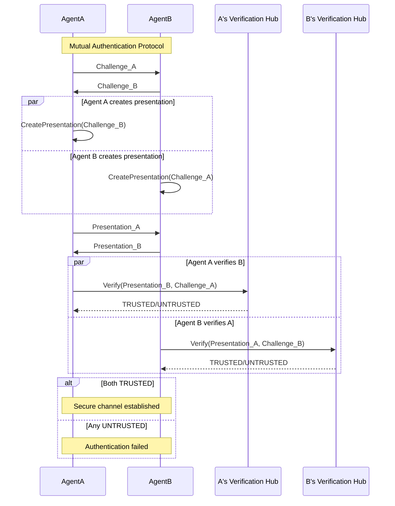

In multi-agent systems, agents often need to authenticate each other before collaborating. Arbiter supports mutual authentication without a trusted third party.

## Flow Overview



---

## Protocol Steps

### Step 1: Exchange Challenges

Both agents generate random challenges:

```python
import secrets

# Agent A generates challenge
challenge_a = secrets.token_hex(32)

# Agent B generates challenge
challenge_b = secrets.token_hex(32)

# Exchange challenges (via any channel)
# A sends challenge_a to B
# B sends challenge_b to A
```

<Note>
Challenges prevent replay attacks. Each presentation is bound to a specific challenge.
</Note>

---

### Step 2: Create Presentations

Each agent creates a presentation responding to the OTHER agent's challenge:

```python
from arbiter.identity import ProofGenerator, create_proof_request

# Agent A creates presentation for B's challenge
presentation_a = generator_a.generate_presentation(
    request=create_proof_request(
        challenge=challenge_b,  # B's challenge
        domain="agent-b",
    ),
    issuer_public_key=issuer_pk,
    accumulator_value=acc_value,
)

# Agent B creates presentation for A's challenge
presentation_b = generator_b.generate_presentation(
    request=create_proof_request(
        challenge=challenge_a,  # A's challenge
        domain="agent-a",
    ),
    issuer_public_key=issuer_pk,
    accumulator_value=acc_value,
)
```

---

### Step 3: Exchange Presentations

Presentations are exchanged:

```python
# A sends presentation_a to B
# B sends presentation_b to A
```

---

### Step 4: Verify

Each agent verifies the presentation they received:

```python
from arbiter import Identity

hub = Identity.create_verification_hub()

# Agent A verifies B's presentation
result_b = hub.verify_presentation(
    presentation=presentation_b,
    expected_challenge=challenge_a,  # A created this challenge
    expected_domain="agent-a",
    issuer_public_key=issuer_pk,
    accumulator_value=acc_value,
)

# Agent B verifies A's presentation  
result_a = hub.verify_presentation(
    presentation=presentation_a,
    expected_challenge=challenge_b,  # B created this challenge
    expected_domain="agent-b",
    issuer_public_key=issuer_pk,
    accumulator_value=acc_value,
)
```

---

### Step 5: Establish Trust

```python
if result_a.is_trusted and result_b.is_trusted:
    print("✓ Mutual authentication successful!")
    print(f"  Agent A trusts B: {result_b.is_trusted}")
    print(f"  Agent B trusts A: {result_a.is_trusted}")
    # Proceed with secure interaction
else:
    print("✗ Authentication failed")
    if not result_a.is_trusted:
        print(f"  B doesn't trust A: {result_a.failure_reason}")
    if not result_b.is_trusted:
        print(f"  A doesn't trust B: {result_b.failure_reason}")
```

---

## Complete Example

```python
from arbiter import Identity
from arbiter.identity import ProofGenerator, create_proof_request
import secrets

# === SETUP: Both agents have credentials ===
issuer = Identity.create_issuer("did:arbiter:issuer")

# Agent A's credential
bundle_a = issuer.issue_agent_identity_credential(
    subject_did="did:arbiter:agent-a",
    agent_name="AgentA",
    agent_type="researcher",
    capabilities=["search"],
)

# Agent B's credential
bundle_b = issuer.issue_agent_identity_credential(
    subject_did="did:arbiter:agent-b",
    agent_name="AgentB",
    agent_type="analyst",
    capabilities=["analyze"],
)

# === STEP 1: Generate and exchange challenges ===
challenge_a = secrets.token_hex(32)
challenge_b = secrets.token_hex(32)

# === STEP 2: Create presentations ===
generator_a = ProofGenerator(
    credential=bundle_a.credential,
    bbs_signature=bundle_a.raw_signature,
    witness=bundle_a.witness,
)

generator_b = ProofGenerator(
    credential=bundle_b.credential,
    bbs_signature=bundle_b.raw_signature,
    witness=bundle_b.witness,
)

acc_value = issuer.revocation_manager.get_current_accumulator()

# A responds to B's challenge
presentation_a = generator_a.generate_presentation(
    request=create_proof_request(challenge=challenge_b, domain="agent-b"),
    issuer_public_key=issuer.bbs_keypair.public_key,
    accumulator_value=acc_value,
)

# B responds to A's challenge
presentation_b = generator_b.generate_presentation(
    request=create_proof_request(challenge=challenge_a, domain="agent-a"),
    issuer_public_key=issuer.bbs_keypair.public_key,
    accumulator_value=acc_value,
)

# === STEP 3 & 4: Exchange and verify ===
hub = Identity.create_verification_hub()

result_b = hub.verify_presentation(
    presentation=presentation_b,
    expected_challenge=challenge_a,
    expected_domain="agent-a",
    issuer_public_key=issuer.bbs_keypair.public_key,
    accumulator_value=acc_value,
)

result_a = hub.verify_presentation(
    presentation=presentation_a,
    expected_challenge=challenge_b,
    expected_domain="agent-b",
    issuer_public_key=issuer.bbs_keypair.public_key,
    accumulator_value=acc_value,
)

# === STEP 5: Mutual trust ===
if result_a.is_trusted and result_b.is_trusted:
    print("✓ Mutual authentication successful!")
    print(f"  A verified B as: {result_b.disclosed_attributes}")
    print(f"  B verified A as: {result_a.disclosed_attributes}")
```

---

## Security Properties

| Property | Guarantee |
|----------|-----------|
| No Replay | Presentations are bound to fresh challenges |
| No Impersonation | Only credential holder can create valid proof |
| No MitM | Domain binding prevents redirection attacks |
| Privacy | Only disclosed attributes are revealed |
| No Third Party | Verification is local, no central authority |

---

## Concurrent Verification

For efficiency, both verifications can happen in parallel:

```python
import asyncio

async def mutual_auth(agent_a, agent_b):
    # Generate challenges
    challenge_a = secrets.token_hex(32)
    challenge_b = secrets.token_hex(32)
    
    # Create presentations concurrently
    presentation_a, presentation_b = await asyncio.gather(
        agent_a.create_presentation(challenge_b),
        agent_b.create_presentation(challenge_a),
    )
    
    # Verify concurrently
    result_a, result_b = await asyncio.gather(
        agent_a.verify(presentation_b, challenge_a),
        agent_b.verify(presentation_a, challenge_b),
    )
    
    return result_a.is_trusted and result_b.is_trusted
```

---

## Next Steps

<CardGroup cols={2}>
  <Card title="Revocation" icon="ban" href="/flows/revocation">
    What happens when credentials are revoked
  </Card>
  <Card title="Access Control" icon="lock" href="/flows/access-control">
    ABAC policy evaluation flow
  </Card>
</CardGroup>
