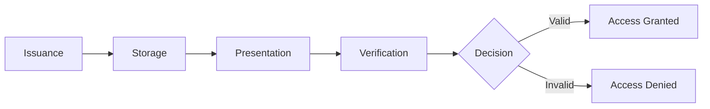
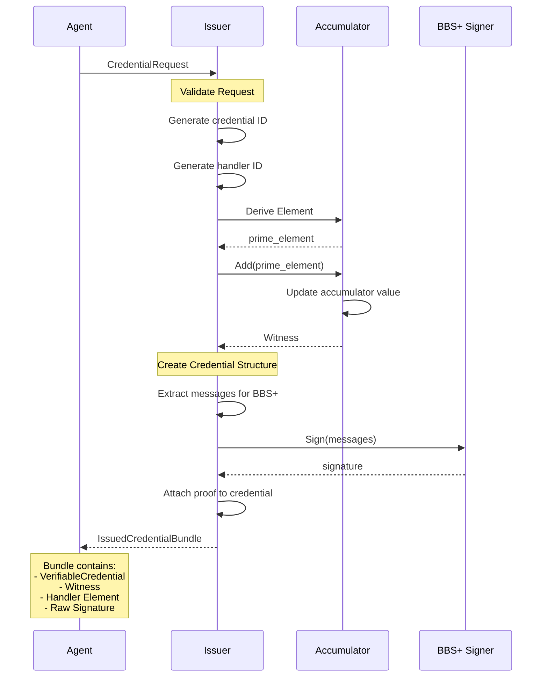
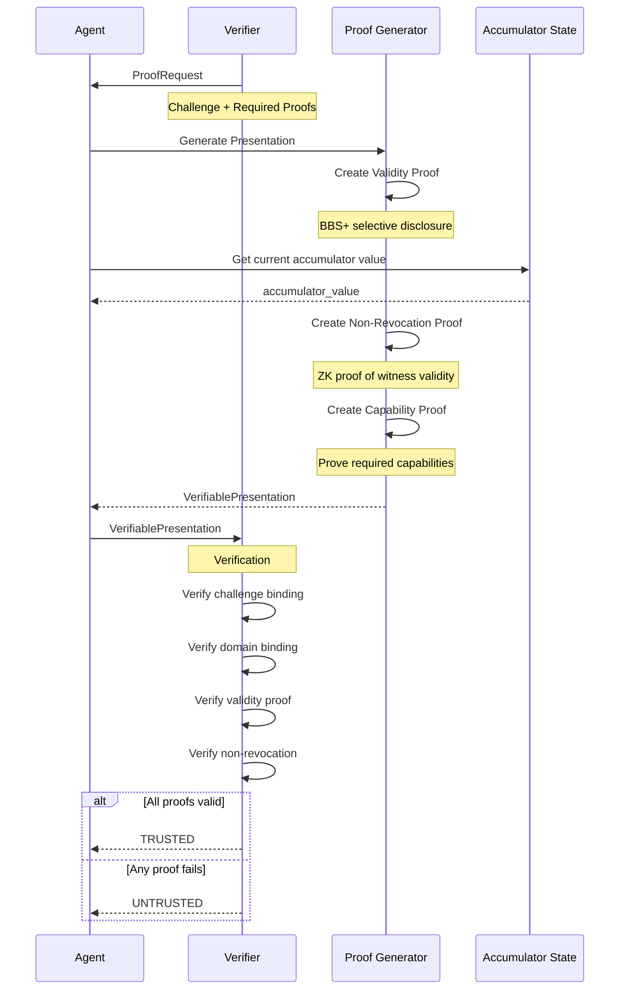

Credentials in Arbiter follow a complete lifecycle from issuance through presentation and verification.

## Credential Lifecycle



---

## Credential Issuance

**Implements Algorithm 2: Credential Issuance**



### Issuing a Credential

```python
from arbiter import Identity
from arbiter.identity import CredentialRequest

# Create issuer
issuer = Identity.create_issuer("did:arbiter:trusted-issuer")

# Issue agent identity credential
bundle = issuer.issue_agent_identity_credential(
    subject_did="did:arbiter:agent",
    agent_name="ResearchBot",
    agent_type="researcher",
    capabilities=["search", "analyze", "summarize"],
)

print(f"Issued credential: {bundle.credential.id}")
print(f"Handler element: {bundle.handler_element}")
print(f"Witness epoch: {bundle.witness.epoch}")
```

### Message Extraction for BBS+

The credential is encoded as a list of messages for BBS+ signing:

```python
messages = [
    credential.id.encode(),                    # Index 0
    credential.issuer.encode(),                # Index 1
    credential.issuance_date.isoformat().encode(),  # Index 2
    credential.credential_subject.id.encode(), # Index 3
    # Claims sorted by key
    b"capability:search",                       # Index 4
    b"capability:analyze",                      # Index 5
    b"agentName:ResearchBot",                   # Index 6
    b"agentType:researcher",                    # Index 7
]
```

---

## Credential Presentation

**Implements Algorithm 3: Credential Presentation**



### Proof Request

The verifier specifies what proofs are required:

```python
from arbiter.identity import ProofRequest, ProofType, create_proof_request

request = create_proof_request(
    challenge=generate_challenge(),  # Random nonce
    domain="verifier.example.com",
    required_proofs=[
        ProofType.CREDENTIAL_VALIDITY,
        ProofType.NON_REVOCATION,
    ],
    required_attributes=["role"],  # Must disclose
    predicate_requirements={
        "required_capabilities": ["search"],  # Prove, don't reveal
    },
)
```

### Creating a Presentation

```python
from arbiter.identity import ProofGenerator

# Create proof generator
generator = ProofGenerator(
    credential=bundle.credential,
    bbs_signature=bundle.raw_signature,
    witness=bundle.witness,
)

# Generate presentation
presentation = generator.generate_presentation(
    request=request,
    issuer_public_key=issuer.bbs_keypair.public_key,
    accumulator_value=current_accumulator_value,
)
```

### Selective Disclosure

```
Original Credential Claims:
├── agentName: "ResearchBot"     [HIDDEN]
├── role: "researcher"           [DISCLOSED]
├── capabilities: ["search"]     [PROVEN via ZK]
└── level: 3                     [HIDDEN]

Verifier learns:
✓ role = "researcher"
✓ Agent has "search" capability (proven, not revealed)
✓ Credential is valid
✓ Credential is not revoked
```

---

## Verification

```python
from arbiter import Identity

# Create verification hub
hub = Identity.create_verification_hub()

# Verify the presentation
result = hub.verify_presentation(
    presentation=presentation,
    expected_challenge=request.challenge,
    expected_domain=request.domain,
    issuer_public_key=issuer_pk,
    accumulator_value=current_accumulator_value,
)

if result.is_trusted:
    print(f"✓ TRUSTED")
    print(f"  Decision: {result.decision}")
    print(f"  Disclosed: {result.disclosed_attributes}")
else:
    print(f"✗ UNTRUSTED: {result.failure_reason}")
```

### Verification Checks

| Check | Description |
|-------|-------------|
| Challenge Binding | Proof is bound to verifier's challenge |
| Domain Binding | Proof is intended for this verifier |
| Validity Proof | BBS+ signature is valid |
| Non-Revocation | Accumulator witness check passes |
| Capability Proof | Required capabilities are proven |

---

## Trust Decision

The verification result includes a trust decision:

```python
from arbiter.identity import TrustDecision

# Possible decisions
TrustDecision.TRUSTED     # Full verification passed
TrustDecision.UNTRUSTED   # Verification failed
TrustDecision.REVOKED     # Credential was revoked
TrustDecision.EXPIRED     # Credential expired
TrustDecision.UNKNOWN     # Could not determine
```

---

## Complete Flow Example

```python
from arbiter import Identity
from arbiter.identity import ProofGenerator, create_proof_request, ProofType

# === ISSUER SETUP ===
issuer = Identity.create_issuer("did:arbiter:issuer")
bundle = issuer.issue_agent_identity_credential(
    subject_did="did:arbiter:agent",
    agent_name="ResearchBot",
    agent_type="researcher",
    capabilities=["search", "analyze"],
)

# === VERIFIER CREATES REQUEST ===
challenge = os.urandom(32).hex()
request = create_proof_request(
    challenge=challenge,
    domain="verifier.example.com",
    required_attributes=["agentType"],
)

# === AGENT CREATES PRESENTATION ===
generator = ProofGenerator(
    credential=bundle.credential,
    bbs_signature=bundle.raw_signature,
    witness=bundle.witness,
)

presentation = generator.generate_presentation(
    request=request,
    issuer_public_key=issuer.bbs_keypair.public_key,
    accumulator_value=issuer.revocation_manager.get_current_accumulator(),
)

# === VERIFIER CHECKS PRESENTATION ===
hub = Identity.create_verification_hub()
result = hub.verify_presentation(
    presentation=presentation,
    expected_challenge=challenge,
    expected_domain="verifier.example.com",
    issuer_public_key=issuer.bbs_keypair.public_key,
    accumulator_value=issuer.revocation_manager.get_current_accumulator(),
)

print(f"Trust decision: {result.decision}")
# Output: Trust decision: TRUSTED
```

---

## Next Steps

<CardGroup cols={2}>
  <Card title="Mutual Authentication" icon="arrows-rotate" href="/flows/authentication">
    Two agents authenticating each other
  </Card>
  <Card title="Revocation" icon="ban" href="/flows/revocation">
    Credential revocation flow
  </Card>
</CardGroup>
