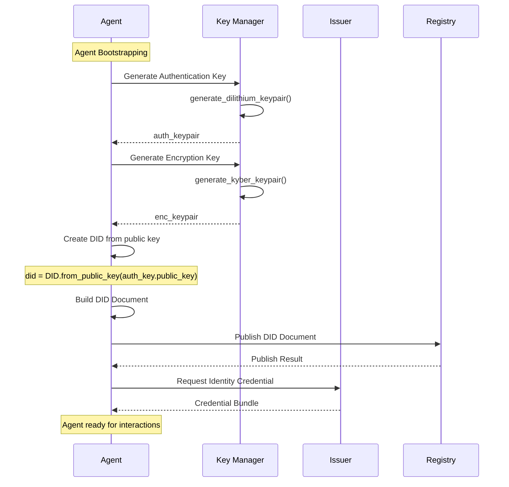

When a new AI agent joins the Arbiter ecosystem, it must complete the onboarding process to establish its cryptographic identity.

## Flow Overview



---

## Step 1: Key Generation

The agent generates its cryptographic keys using post-quantum algorithms.

```python
from arbiter import Identity

# Create key manager
key_manager = Identity.create_key_manager()

# Generate authentication key (Dilithium - for signatures)
auth_key = key_manager.generate_authentication_key()
print(f"Auth key generated: {auth_key.key_id}")

# Generate encryption key (Kyber - for key exchange)
enc_key = key_manager.generate_encryption_key()
print(f"Encryption key generated: {enc_key.key_id}")

# Generate assertion key (for signing credentials)
assertion_key = key_manager.generate_assertion_key()
print(f"Assertion key generated: {assertion_key.key_id}")
```

### Key Types

| Key Type | Algorithm | Purpose |
|----------|-----------|---------|
| Authentication | Dilithium | Sign challenges, prove identity |
| Encryption | Kyber | Establish encrypted channels |
| Assertion | Dilithium | Sign assertions and claims |

---

## Step 2: DID Creation

Create a Decentralized Identifier from the agent's public key.

```python
from arbiter import DID
from arbiter.identity import DIDDocumentBuilder

# Create DID from public key
did = DID.from_public_key(auth_key.public_key.public_key_bytes)
print(f"Agent DID: {did.did_string}")
# Output: did:arbiter:2N4Q...

# Build complete DID document
builder = DIDDocumentBuilder(did)
builder.add_authentication_key(auth_key.public_key.public_key_bytes)
builder.add_key_agreement_key(enc_key.public_key.public_key_bytes)
builder.add_assertion_key(assertion_key.public_key.public_key_bytes)

document = builder.build()
```

### DID Document Structure

```json
{
  "@context": ["https://www.w3.org/ns/did/v1"],
  "id": "did:arbiter:2N4Q...",
  "verificationMethod": [
    {
      "id": "did:arbiter:2N4Q...#key-1",
      "type": "Dilithium3VerificationKey2024",
      "controller": "did:arbiter:2N4Q...",
      "publicKeyMultibase": "z..."
    },
    {
      "id": "did:arbiter:2N4Q...#key-2",
      "type": "Kyber768KeyAgreementKey2024",
      "controller": "did:arbiter:2N4Q...",
      "publicKeyMultibase": "z..."
    }
  ],
  "authentication": ["did:arbiter:2N4Q...#key-1"],
  "keyAgreement": ["did:arbiter:2N4Q...#key-2"],
  "assertionMethod": ["did:arbiter:2N4Q...#assertion-key"]
}
```

---

## Step 3: Registry Publication

Publish the DID document for resolution by other agents.

```python
from arbiter.identity import InMemoryRegistry

# Create registry instance (or connect to blockchain)
registry = InMemoryRegistry()

# Sign the document
signature = key_manager.sign(
    auth_key.key_id,
    document.to_bytes()
)

# Publish
result = registry.publish_did(document, signature)

if result.success:
    print(f"DID published successfully!")
    print(f"Transaction: {result.transaction_id}")
else:
    print(f"Publication failed: {result.error}")
```

<Note>
In production, the registry would be a blockchain or distributed ledger for decentralized trust.
</Note>

---

## Step 4: Request Identity Credential

Request a verifiable credential from a trusted issuer.

```python
from arbiter import Identity
from arbiter.identity import CredentialRequest

# Create request
request = CredentialRequest(
    subject_did=did.did_string,
    credential_type="AgentIdentityCredential",
    claims={
        "agentName": "ResearchBot",
        "agentType": "researcher",
        "capabilities": ["search", "analyze", "summarize"],
    }
)

# Get credential from issuer
issuer = Identity.create_issuer("did:arbiter:trusted-issuer")
bundle = issuer.issue_credential(request)

print(f"Credential ID: {bundle.credential.id}")
print(f"Witness epoch: {bundle.witness.epoch}")
```

### Credential Bundle Contents

| Component | Description |
|-----------|-------------|
| `credential` | The `VerifiableCredential` object |
| `witness` | For non-revocation proofs |
| `handler_element` | Accumulator element (prime) |
| `raw_signature` | BBS+ signature for selective disclosure |

---

## Step 5: Store Credentials

Securely store the credential bundle for future use.

```python
# Store in secure credential wallet
wallet = SecureCredentialWallet()
wallet.store(
    credential_id=bundle.credential.id,
    credential=bundle.credential,
    witness=bundle.witness,
    handler_element=bundle.handler_element,
    signature=bundle.raw_signature,
)

print("Credential stored securely")
```

---

## Complete Onboarding Example

```python
from arbiter import Identity, DID
from arbiter.identity import DIDDocumentBuilder, InMemoryRegistry

# === STEP 1: KEY GENERATION ===
key_manager = Identity.create_key_manager()
auth_key = key_manager.generate_authentication_key()
enc_key = key_manager.generate_encryption_key()
assertion_key = key_manager.generate_assertion_key()

# === STEP 2: DID CREATION ===
did = DID.from_public_key(auth_key.public_key.public_key_bytes)

builder = DIDDocumentBuilder(did)
builder.add_authentication_key(auth_key.public_key.public_key_bytes)
builder.add_key_agreement_key(enc_key.public_key.public_key_bytes)
builder.add_assertion_key(assertion_key.public_key.public_key_bytes)
document = builder.build()

# === STEP 3: REGISTRY PUBLICATION ===
registry = InMemoryRegistry()
signature = key_manager.sign(auth_key.key_id, document.to_bytes())
result = registry.publish_did(document, signature)

# === STEP 4: GET CREDENTIAL ===
issuer = Identity.create_issuer("did:arbiter:issuer")
bundle = issuer.issue_agent_identity_credential(
    subject_did=did.did_string,
    agent_name="ResearchBot",
    agent_type="researcher",
    capabilities=["search", "analyze"],
)

# === AGENT READY ===
print(f"✓ Agent onboarded successfully!")
print(f"  DID: {did.did_string}")
print(f"  Credential: {bundle.credential.id}")
```

---

## Summary

| Step | Action | Output |
|------|--------|--------|
| 1 | Key Generation | Auth, Encryption, Assertion keys |
| 2 | DID Creation | `did:arbiter:...` + DID Document |
| 3 | Registry Publication | Publicly resolvable DID |
| 4 | Credential Request | Identity Credential + Witness |
| 5 | Storage | Secured in wallet |

---

## Next Steps

<CardGroup cols={2}>
  <Card title="Credential Issuance" icon="id-card" href="/flows/credentials">
    Deep dive into credential lifecycle
  </Card>
  <Card title="Mutual Authentication" icon="arrows-rotate" href="/flows/authentication">
    Authenticate between agents
  </Card>
</CardGroup>
