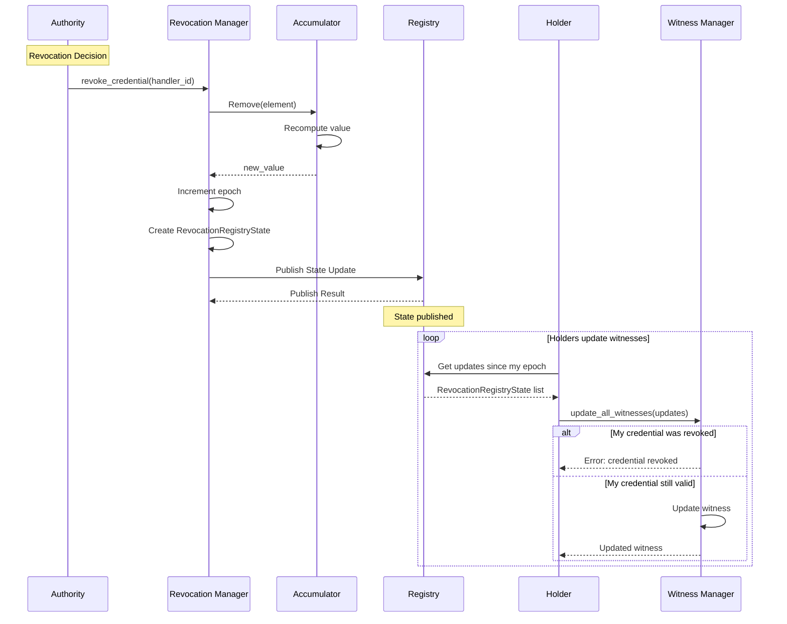
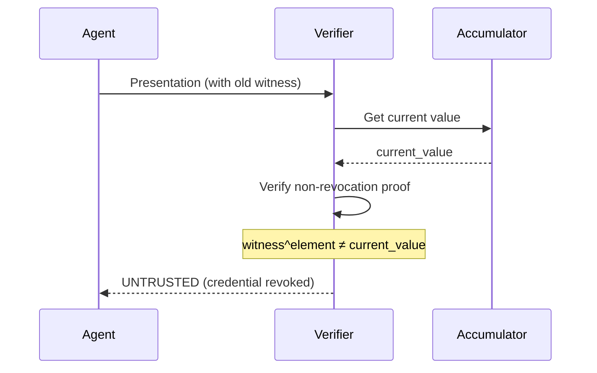

Arbiter's revocation system enables instant credential invalidation using cryptographic accumulators.

## Flow Overview

**Implements Algorithms 4 & 5: Revocation and Witness Update**



---

## Revocation Algorithm

### Step 1: Authority Initiates Revocation

```python
from arbiter import Identity

# Get revocation manager
revocation_manager = Identity.create_revocation_manager()

# Revoke credential by handler ID
handler_id = "handler:abc123"  # From credential bundle
state = revocation_manager.revoke_credential(handler_id)

print(f"Revoked at epoch: {state.epoch}")
print(f"New accumulator: {state.accumulator_value[:32]}...")
```

### Step 2: Accumulator Update

Internally, the revocation removes the element from the accumulator:

```python
# Remove element from accumulator
# A_new = A_old^{element^{-1} mod λ(n)} mod n
new_accumulator = accumulator.remove(handler_element)
```

### Step 3: Publish State

```python
from arbiter.identity import InMemoryRegistry

registry = InMemoryRegistry()

# Publish revocation state
result = registry.publish_revocation_state(
    registry_id=state.registry_id,
    accumulator_value=state.accumulator_value,
    epoch=state.epoch,
    revoked_handlers=[handler_id],
    signature=sign(state),
)

if result.success:
    print("Revocation state published")
```

---

## Witness Update Algorithm

Holders with valid credentials must update their witnesses when revocations occur.

### Step 1: Fetch Updates

```python
# Holder checks for updates
my_epoch = my_witness.epoch
updates = registry.get_updates_since(my_epoch)

print(f"Found {len(updates)} updates since epoch {my_epoch}")
```

### Step 2: Check for Own Revocation

```python
from arbiter.identity import WitnessManager

witness_manager = WitnessManager()

# Check if my credential was revoked
for update in updates:
    if my_handler_id in update.revoked_handlers:
        raise CredentialRevokedError("My credential was revoked!")
```

### Step 3: Update Witness

```python
# Update witness for each revocation
my_element = derive_element(my_handler_id)

for update in updates:
    for revoked_handler in update.revoked_handlers:
        revoked_element = derive_element(revoked_handler)
        
        # Witness update formula using Bezout coefficients
        # witness_new = witness^a · A_new^b mod n
        # where a·my_element + b·revoked_element = 1
        my_witness = update_witness_for_removal(
            my_witness,
            my_element,
            revoked_element,
            update.accumulator_value,
        )

print(f"Witness updated to epoch {my_witness.epoch}")
```

---

## Revoked Credential Detection

Verifiers automatically detect revoked credentials:



### Verification Failure

```python
from arbiter import Identity

hub = Identity.create_verification_hub()

result = hub.verify_presentation(
    presentation=old_presentation,
    expected_challenge=challenge,
    expected_domain=domain,
    issuer_public_key=issuer_pk,
    accumulator_value=current_accumulator_value,  # Updated value
)

if result.decision == TrustDecision.REVOKED:
    print("Credential has been revoked!")
    print(f"Revocation detected at: {result.revocation_time}")
```

---

## Complete Revocation Example

```python
from arbiter import Identity
from arbiter.identity import InMemoryRegistry

# === SETUP ===
issuer = Identity.create_issuer("did:arbiter:issuer")
registry = InMemoryRegistry()

# Issue two credentials
bundle_valid = issuer.issue_agent_identity_credential(
    subject_did="did:arbiter:valid-agent",
    agent_name="ValidAgent",
)

bundle_revoked = issuer.issue_agent_identity_credential(
    subject_did="did:arbiter:bad-agent",
    agent_name="BadAgent",
)

print(f"Issued 2 credentials")
print(f"Current epoch: {issuer.revocation_manager.current_epoch}")

# === REVOKE ONE CREDENTIAL ===
state = issuer.revocation_manager.revoke_credential(
    bundle_revoked.handler_id
)
registry.publish_revocation_state(state)

print(f"Revoked credential: {bundle_revoked.credential.id}")
print(f"New epoch: {state.epoch}")

# === VALID HOLDER UPDATES WITNESS ===
updates = registry.get_updates_since(bundle_valid.witness.epoch)
bundle_valid.witness = update_all_witnesses(
    bundle_valid.witness,
    bundle_valid.handler_element,
    updates,
)
print(f"Valid holder updated witness to epoch {bundle_valid.witness.epoch}")

# === VERIFY BOTH ===
hub = Identity.create_verification_hub()
current_acc = issuer.revocation_manager.get_current_accumulator()

# Valid credential passes
result_valid = verify_credential(bundle_valid, current_acc)
print(f"Valid credential: {result_valid.decision}")  # TRUSTED

# Revoked credential fails
result_revoked = verify_credential(bundle_revoked, current_acc)
print(f"Revoked credential: {result_revoked.decision}")  # REVOKED
```

---

## Revocation Properties

| Property | Guarantee |
|----------|-----------|
| **Instant** | Revocation effective immediately |
| **Tamper-Evident** | Cannot hide revocation |
| **Efficient** | O(1) verification time |
| **Privacy** | Revocation doesn't reveal credential contents |
| **Batch Updates** | Holders update O(k) for k revocations |

---

## Best Practices

<AccordionGroup>
  <Accordion title="Regular Witness Updates">
    Holders should periodically check for revocation updates:
    
    ```python
    # Cron job or background task
    async def update_witnesses():
        updates = await registry.get_updates_since(my_epoch)
        if updates:
            update_all_witnesses(updates)
    ```
  </Accordion>
  
  <Accordion title="Before Presentation">
    Always update witness before creating presentations:
    
    ```python
    # Ensure witness is current
    updates = registry.get_updates_since(witness.epoch)
    if updates:
        witness = update_all_witnesses(updates)
    
    # Now create presentation
    presentation = generate_presentation(...)
    ```
  </Accordion>
  
  <Accordion title="Handle Revocation Gracefully">
    Be prepared for your own credential to be revoked:
    
    ```python
    try:
        update_witnesses(updates)
    except CredentialRevokedError:
        # Request new credential
        new_bundle = request_new_credential()
    ```
  </Accordion>
</AccordionGroup>

---

## Next Steps

<CardGroup cols={2}>
  <Card title="Access Control" icon="lock" href="/flows/access-control">
    ABAC policy evaluation flow
  </Card>
  <Card title="Accumulators" icon="database" href="/cryptography/accumulators">
    Deep dive into accumulator crypto
  </Card>
</CardGroup>
