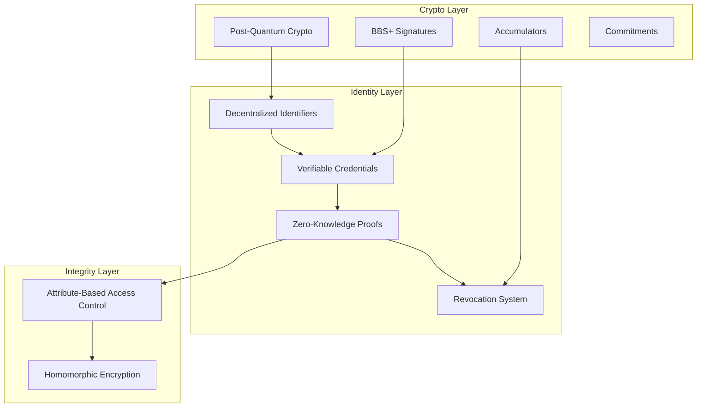

## What is Arbiter?

Arbiter provides a complete security layer for autonomous AI agents, addressing the fundamental challenge:

<Note>
**How can AI agents securely identify themselves and control access to resources in a decentralized, privacy-preserving manner?**
</Note>

Built with **post-quantum cryptography** and **zero-knowledge proofs**, Arbiter ensures your AI agents are secure against both current and future threats.

## Key Features

<CardGroup cols={2}>
  <Card title="Decentralized Identity" icon="fingerprint">
    Self-sovereign DIDs for AI agents with W3C compliance
  </Card>
  <Card title="Zero-Knowledge Proofs" icon="shield-halved">
    Prove claims without revealing underlying credentials
  </Card>
  <Card title="Post-Quantum Security" icon="atom">
    Dilithium signatures and Kyber key encapsulation
  </Card>
  <Card title="Instant Revocation" icon="ban">
    O(1) revocation checking via cryptographic accumulators
  </Card>
  <Card title="Fine-Grained Access" icon="lock">
    Attribute-Based Access Control (ABAC) policies
  </Card>
  <Card title="Privacy-Preserving" icon="eye-slash">
    Paillier homomorphic encryption for secure computation
  </Card>
</CardGroup>

## Architecture Overview

Arbiter consists of two main layers:



### Identity Layer

Manages agent identity through:
- **DIDs**: Decentralized Identifiers for self-sovereign identity
- **Verifiable Credentials**: BBS+ signed claims with selective disclosure
- **ZK Proofs**: Privacy-preserving verification
- **Revocation**: Cryptographic accumulators for instant revocation

### Integrity Layer

Enforces access control through:
- **ABAC**: Policy-based authorization using verified attributes
- **Homomorphic Encryption**: Privacy-preserving aggregation

## Design Principles

<AccordionGroup>
  <Accordion title="Zero-Knowledge by Default">
    Agents prove claims without revealing underlying credentials. Verifiers learn only what proofs reveal—nothing more.
  </Accordion>
  <Accordion title="Post-Quantum Security">
    All signatures use Dilithium (ML-DSA) and key encapsulation uses Kyber (ML-KEM), ensuring security against quantum adversaries.
  </Accordion>
  <Accordion title="Instant Revocation">
    Cryptographic accumulators enable O(1) revocation checking without credential reissuance.
  </Accordion>
  <Accordion title="Deterministic Authorization">
    ABAC policies produce identical decisions given identical inputs—no hidden state or race conditions.
  </Accordion>
  <Accordion title="Minimal Trust">
    No central identity authority required. No trusted third parties for verification. Proofs are self-verifying.
  </Accordion>
</AccordionGroup>

## Quick Example

```python
from arbiter import Identity, Integrity

# Create agent identity
key_manager = Identity.create_key_manager()
auth_key = key_manager.generate_authentication_key()

# Create issuer
issuer = Identity.create_issuer("did:arbiter:issuer")

# Issue credential
bundle = issuer.issue_agent_identity_credential(
    subject_did="did:arbiter:agent",
    agent_name="ResearchBot",
    agent_type="researcher",
    capabilities=["search", "analyze"],
)

# Setup access control
pep = Integrity.create_enforcement_point()
result = pep.enforce(
    subject_did="did:arbiter:agent",
    resource_id="data/research",
    action="read",
)

if result.permitted:
    print("Access granted!")
```

## Next Steps

<CardGroup cols={2}>
  <Card title="Quickstart" icon="rocket" href="/quickstart">
    Get up and running in 5 minutes
  </Card>
  <Card title="Architecture" icon="sitemap" href="/architecture/overview">
    Deep dive into Arbiter's design
  </Card>
  <Card title="Cryptography" icon="key" href="/cryptography/pqc">
    Understand the crypto primitives
  </Card>
  <Card title="API Reference" icon="code" href="/api-reference/identity">
    Explore the full API
  </Card>
</CardGroup>
